对应的论文地址：[Radiology report generation with a learned knowledge base and multi-modal alignment - ScienceDirect](https://www.sciencedirect.com/science/article/pii/S1361841523000592)

# 1环境准备

```python
## 创建虚拟环境
conda create -n report_generation_for_M2KT pip python=3.6
## 激活虚拟环境
conda activate report_generation_for_M2KT
## 安装pytorch
# CUDA 11.0
conda install pytorch==1.7.0 torchvision==0.8.0 torchaudio==0.7.0 cudatoolkit=11.0 -c pytorch
# 更换镜像源
conda install pytorch==1.7.0 torchvision==0.8.0 torchaudio==0.7.0 cudatoolkit=11.0 -c https://mirrors.tuna.tsinghua.edu.cn/anaconda/cloud/pytorch/linux-64/
# 之后根据代码中包的确实情况进行安装，相关缺失的包如下：
config/config.py: yaml、yacs

# 此外，根据3.3节总结的报错信息，还需要安装以下的包：
# pandas --直接在对应的代码位置按照提示点击install即可
pip install Cython
pip install pycocoevalcap
pip install --upgrade pip
pip install tensorboardX
pip uninstall yacs # 卸载0.1.6
pip install yacs # 默认安装0.1.8版本的
```

## 1.1相关包安装的命令

```python
conda create -n report_generation_for_M2KT pip python=3.6

conda install pytorch==1.7.0 torchvision==0.8.0 torchaudio==0.7.0 cudatoolkit=11.0 -c https://mirrors.tuna.tsinghua.edu.cn/anaconda/cloud/pytorch/linux-64/

pip install --upgrade pip

conda install yaml

pip install Cython
pip install pycocoevalcap
pip install tensorboardX
pip install yacs

pip install pandas
pip install scipy
pip install tqdm
pip install ipdb

```


# 2数据集准备

## 2.1IU数据集下载及解析

1. 官方并没有提供划分好的IU数据集(虽然有[下载链接](https://openi.nlm.nih.gov/faq#collection))，因此这篇论文使用了论文[R2Gen](https://github.com/zhjohnchan/R2Gen)中提供的划分好训练集、验证集和测试集的数据

   1. 与官方提供的IU数据集相比，这个对图像进行了整理，并将报告中的关键信息都整理到了`annotation.json`文件中

   2. 如下图所示，图片被分类整理，每个文件夹应该是对应于一个病例，其中有几张从不同视角拍摄的肺部放射图像，如下图所示

      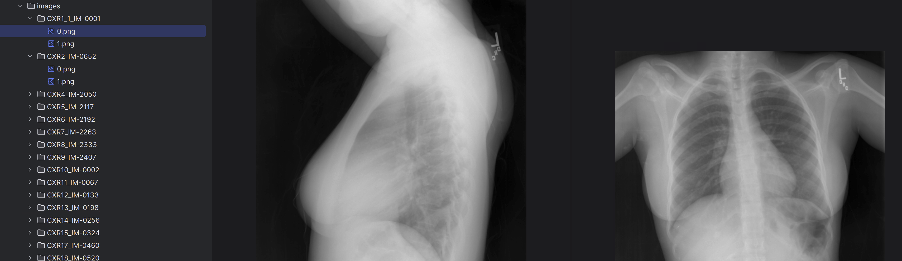

   3. 总共包含`6091`张图片，如下图所示

      

   4. 在`annotation.json`文件中，按照`7:1:2`的比例划分了`train`、`val`、`test`，分别包含`2069`、`296`、`590`条数据，共计`2955`条数据。

      1. `2955`对应于`images`文件夹下面的`2955`个文件夹，所以可以知道，这`2955`个文件夹代表`2955`个患者。

      2. 因此，这每一条数据对应一个报告，一个报告则对应`n`张($n\geq2$)，如下图所示。

         

      3. 每一条数据都包含四个键：`id`、`report`、`image_path`、`split`。如下面的两张图所示：

         

         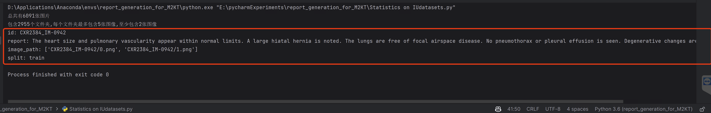
         
      4. 因此，annotation文件的格式为：一个大字典，有`train`、`val`、`test`三个键值对；每一个键对应一个数据列表，列表里面的每一个元素都是一个字典，该字典有4个键，即`id`、`report`、`image_path`、`split`

2. 按照这篇文章代码中所述

   1. 图像全部放入`data/iu/images/iu_2image/images/`
   2. 标注放到`data/iu/images/iu_2image/annotation.json`

## 2.2使用CheXpert抽取标签

1. 论文中提到：为了保持一致性，我们使用 CheXpert 提取 IU-Xray 数据集的标签。因此需要使用[chexpert-labeler](https://github.com/stanfordmlgroup/chexpert-labeler)来抽取IU数据集的标签

2. chexpert-labeler作用：从报告中抽取观察的结果

   1. 所谓观察结果就是：根据报告的描述，判断其中描述了哪种疾病，如下图所示

      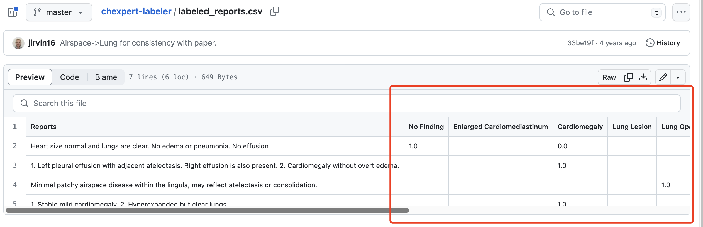

   2. 所以这篇文章中所说的标签就是`12`种疾病标签，以及`2`个单独设置的标签(`No finding`和`Support device`)

   3. 观察结果作为图像的结构化的标签。具体的`14`个标签如下图所示

      

### 2.2.1环境准备

```python
## 创建虚拟环境
# conda create -n chexpert-label pip python=3.8
# 这里直接在autodl平台，选择pytorch-1.7.0 python 3.8，并没有自己创建虚拟环境
# 由于bllipparser无法在Windows上编译，因此只能在linux或者mac上去跑这个项目了
# 因此只在autodl上跑吧
# 后来又装了deepin操作系统，然后在系统上重新跑了一遍，生成了需要的标签文件
conda activate chexpert-label # 报错
source activate chexpert-label
conda deactivate
conda activate chexpert-label # 然后就不报错了
# conda install nltk==3.3.0
pip install --user -U nltk

conda install pandas
pip install bioc
pip install pathlib2
pip install bllipparser
pip install pystanforddependencies
pip install networkx
pip install ply

sudo apt-get update
sudo apt-get install openjdk-8-jdk
pip uninstall networkx
pip install networkx==1.11 # 要指定版本，否则报错

# 将total_loc = ann.get_total_location()改为total_loc = ann.total_span
```

之后运行`files_used/label.py`文件即可

### 2.2.2IU数据集报告标签生成

1. 如下图所示，是读取标签文件的过程：

   

2. 分析

   1. 根据上图代码过程知道，这个csv文件中是有标题的
   2. 因为`pandas`版本的原因，这里的`label = row[1:].to_list()`需要改成`label = row[1:].tolist()`

3. 分析完之后，构建代码来读取iu数据集的报告进行打标签。

   1. 为了保险起见，会对所有的待打标签的报告都加上英文状态下的引号
   
   2. 一次性对所有的数据(训练集+验证集+测试集)的报告打标签，存放在一个csv文件中
   
   3. 下图是处理的前三条数据的结果，第二张图是处理之后存储在csv文件中的样子
   
      
   
      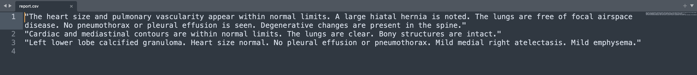
   
   4. 为了后续的需要，除了读取report键以外，还读取了id键
   
   5. 最后保存了三种结构的标签结果文件：`labeled_reports_with_report_with_id.csv`、`labeled_reports_with_report_without_id.csv`、`labeled_reports_without_report_with_id.csv`
   
      1. 最终用于实验的是包含id，但是不包含报告的。
   
      2. 三种文件如下图所示：
   
         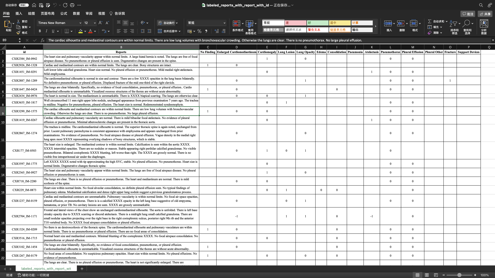
   
         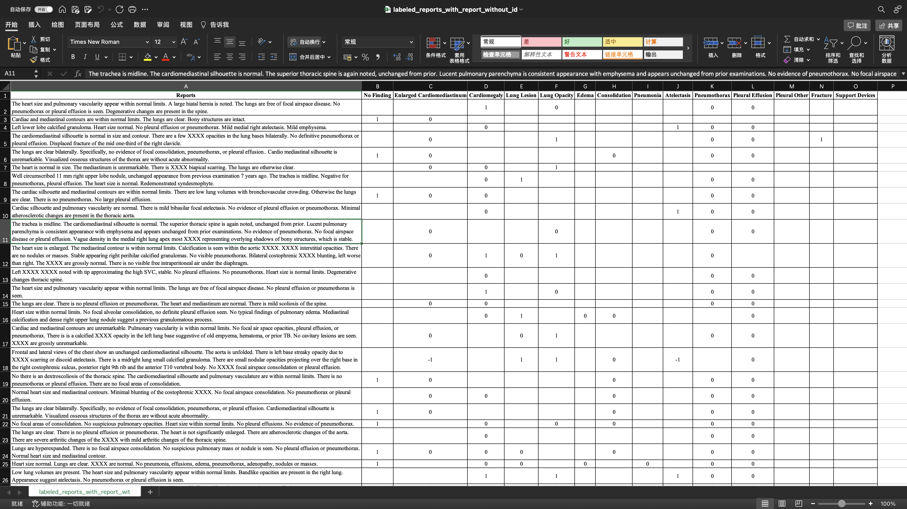
   
         

## 2.3运行配置-在编辑界面模仿命令行调用

> 参考：[pycharm使用命令行运行和调试python程序_pycharm中如何在终端输入指令调试代码_Jeremy_权的博客-CSDN博客](https://blog.csdn.net/weixin_43992162/article/details/119894794?ydreferer=aHR0cHM6Ly9jbi5iaW5nLmNvbS8%3D)

1. 右击要运行的文件，这里是`main.py`，选择下图的选项，修改运行配置

   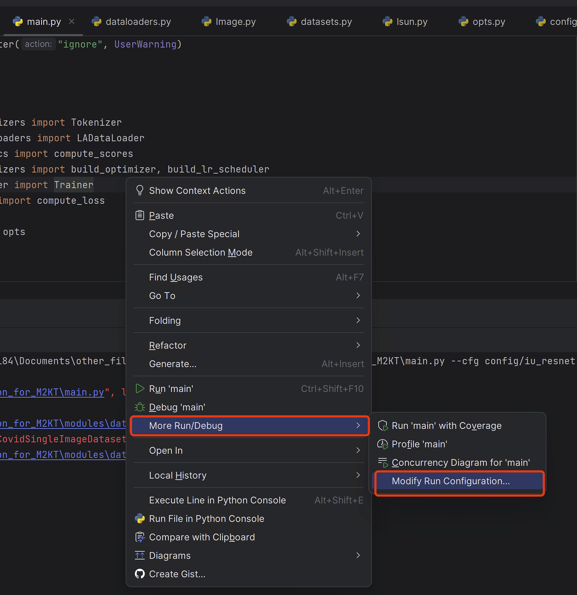

2. 先勾选右侧的`parameters`，然后在左侧对应的位置将命令行调用时py文件之后的参数复制进去

   

3. 之后，就可以右键运行或者调试该文件了。

# 3模型解析(以iu-xray数据集为例)

## 3.1从`main.py`文件出发的

1. 项目地址给出运行`main.py`文件的命令行代码（完整模型）：

   ```python
   python main.py --cfg config/{$dataset_name}_resnet.yml --expe_name {$experiment name} --label_loss --rank_loss --version 12
   ```

   1. `cfg`：要使用的配置文件

   2. `expe_name`：实验名称，应该是额外用来标识每次实验的

   3. `label_loss`：应该是在优化的时候是否计算标签损失的设置项；命令行中出现这个参数，则这个参数将被置为`True`（默认为`false`，因为`action='store_true'`的原因）

   4. `rank_loss`：类似于`label_loss`的设置项（具体干什么用的还得看完代码才知道）

   5. `version`：视觉特征提取器模型的版本，默认为`0`

   6. 如果要使用IU数据集，则命令变为：

      ```python
      python main.py --cfg config/iu_resnet.yml --expe_name iu_main_1 --label_loss --rank_loss --version 12
      ```

2. 执行`main.py`函数，首先会将配置导入，其次设置随机数生成器种子
3. 接下来构建分词器`Tokenizer`

### 3.1.1分词器Tokenizer

1. 这里只是初始化一下分词器，如下图所示

   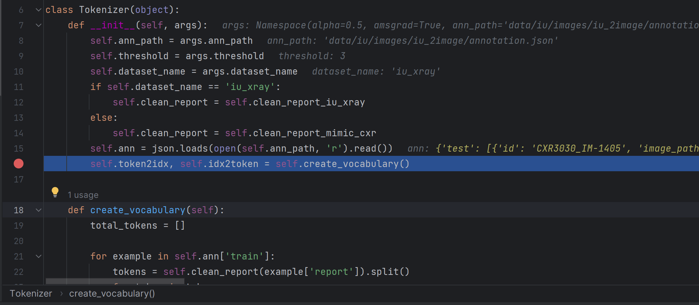

   1. 这里直接将annotation文件中的所有数据全部读取进来了(因为接下来是根据report的内容来构建词汇表)，如下图所示。

      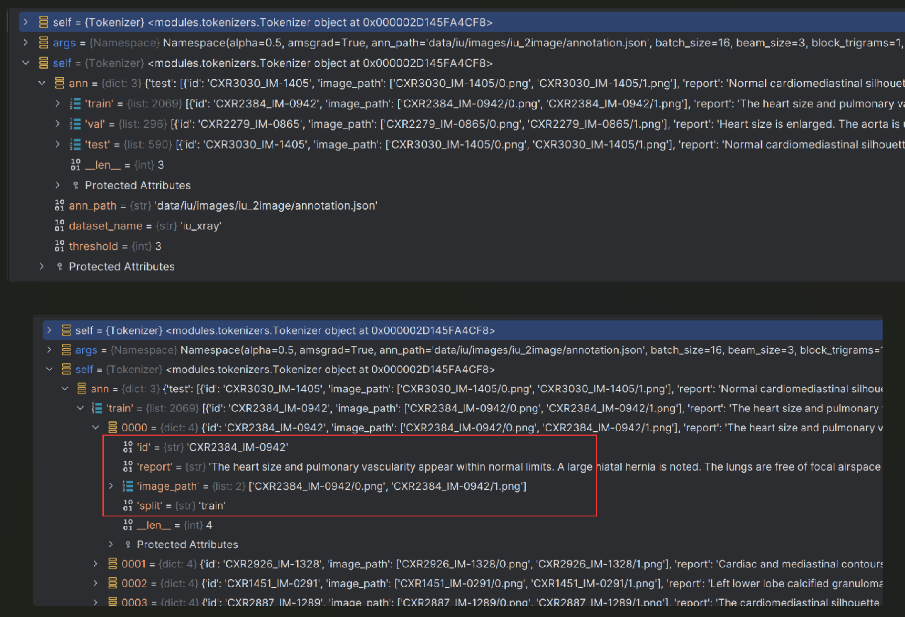

   2. 接下来遍历所有的报告，分词，构建词汇表：

      1. 下图是分词之后的结果

         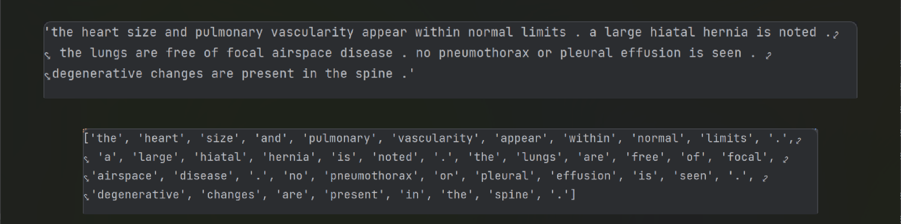

      2. 然后统计每个词出现的次数，并按照设定的阈值进行删减，再加入`<unk>`表示未在词表中的词，然后进行排序，最终得到的词表包含`760`个词(包含句号和`<unk>`)

         

      3. 然后构建词和索引之间的对应关系，用字典存储。

         1. 第一个元素的索引从`1`开始

         

### 3.1.2数据加载器LADataLoader

> 构建训练集、测试集、验证集的数据加载器，其中训练集的数据加载器会进行打乱的操作，即`shuffle=True`
>
> 以训练集的数据加载器为例描述整个过程

1. 首先初始化一些类变量，以及一个用于对输入图像进行标准化的变量`normalize`，如下图所示：

   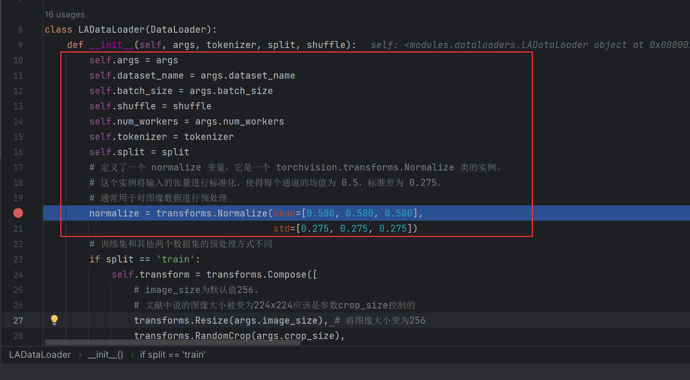

2. 接下来使用`torchvision.transforms.Compose`对象构建一个包含多个步骤的图像与处理序列：

   1. `transforms.Resize(args.image_size)`：将图像的大小调整为`args.image_size`。其中`args.image_size`是一个参数，可以是任何整数或元组。但是是整数或者元组的时候进行的具体操作不同：

      1. 如果`args.image_size`是一个整数，则将图像的<u>短边</u>调整为该整数，<u>长边按比例缩放</u>。
      2. 如果`args.image_size`是一个元组，则将图像的大小调整为该元组中的值。例如，如果`args.image_size`是`(256, 256)`，则将图像的大小调整为`256x256`

   2. `transforms.RandomCrop(args.crop_size)`：与`resize`类似，但有所不同。将图像随机裁剪为大小为`args.crop_size`的图像：

      1. 如果`args.crop_size`是一个整数，则将图像裁剪为正方形，边长为该整数。
      2. 如果`args.crop_size`是一个元组，则将图像裁剪为该元组中的大小。

   3. `transforms.RandomHorizontalFlip()`：是一个数据增强操作，它以`0.5`的概率随机水平翻转图像，如下图所示。

      1. 具体来说，如果随机数小于`0.5`，则将图像水平翻转，否则不进行翻转。
      2. 水平翻转是指将图像沿着垂直中心轴进行翻转，即将图像左右翻转

      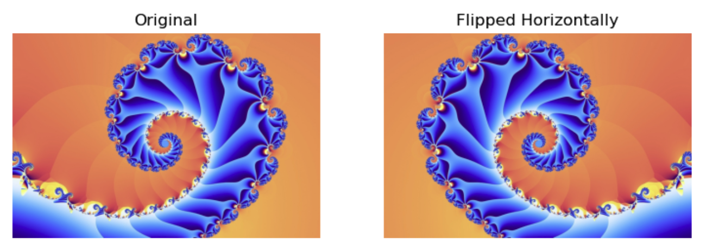

   4. `transforms.RandomAffine(degrees=0, translate=(0.2, 0.2), scale=(0.8, 0.8), fillcolor=(0, 0, 0))`：随机仿射变换，包括旋转、平移和缩放，具体参数如下图所示：

      

   5. 最后，使用`transforms.ToTensor()`将图像转为张量，并用`normalize`变量进行标准化

3. 加载数据集（以IU数据集为例）

   1. 调用`IuxrayMultiImageDataset`类创建数据集实例

      1. 首先调用数据集基类，如下图所示

         

      2. 基类属性创建好之后，`IuxrayMultiImageDataset`类中还要初始化一下IU数据集报告的标签
      
         1. 因此首先需要按照论文所说的，事先构建一下IU数据集的标签文件，详见 [2.2.2IU数据集报告标签生成](#2.2.2IU数据集报告标签生成)
         1. 然后将只有`id`，没有报告的标签文件放到`data/iu/r2gen_split/id_label.csv`
      
      3. 读取标签文件
      
         1. 按行读取，获取每一行的`id`、以及`14`种观察结果，如下图所示
      
            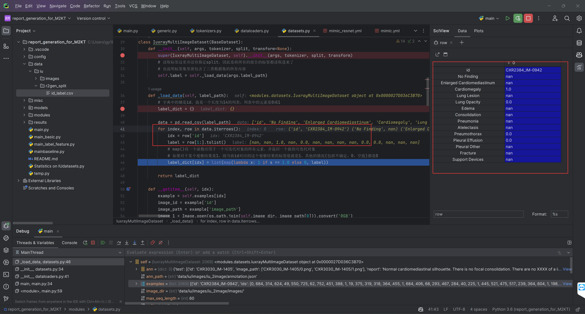
      
         2. 然后得到一个标签字典`label_dict`，其中的`key`是放射图像(或者理解为患者)的`id`，`value`是一个标签列表，`1`表示有对应的观察结果。如下图所示
      
            
      

4. 将数据加载器的相关重要参数放到`LADataLoader`类的`init_kwargs`变量中，然后调用父类的初始化函数返回一个数据加载器对象

   1. `collate_fn`函数：用来处理`DataLoader`返回的每个batch的数据的

   2. `num_workers`：用于指定数据加载器使用的子进程数量，具体介绍如下图所示

      

   3. `pin_memory`：设置为`True`，则会将数据复制到固定的内存区域（锁页内存），这样可以加速数据传输。具体如下图所示

      

5. 至此，数据加载器就完成了创建。验证集和测试集类似，如下图所示（大部分的参数都在创建的过程中提到了）。

   

   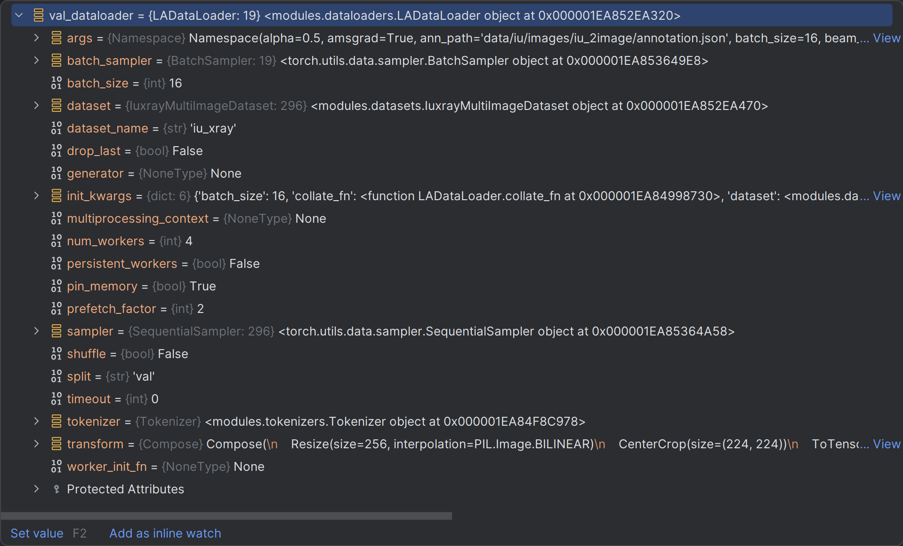

   

#### 3.1.2.1`collate_fn`函数解析

见[3.1.7.1.2数据的处理之collate_fn方法](#3.1.7.1.2数据的处理之collate_fn方法)

### 3.1.3创建模型结构

> 1. 这里创建模型结构的过程涉及到众多参数，也涉及到层层的类继承
> 2. `lamrg.py`文件应该是本论文自己的模型

1. 这里的创建过程为：递归调用`LAMRGModel_v12`类的初始化函数、`LAMRGModel_v9`类的初始化函数、`_LAMRG`类的初始化函数

#### 3.1.3.1调用`_LAMRG`类的初始化函数

> 1. 包括初始化参数`args`、分词器`tokenizer`、视觉特征提取器`visual_extractor`、transformer的编码器解码器结构`encoder_decoder`、以及一个处理14种观察结果的线性层
>    1. 参数在很多类中都在不断地传递，因为在这些类中需要用到参数里面的一些设置

##### 3.1.3.1.1`visual_extractor`的创建

> 1. 这里使用的模型是`resnet101`

1. 模型创建过程如下，代码如下图所示

   1. 从官方获取`resnet101`模型，并加载官方的预训练权重
   2. 然后去除掉模型最后两个层，只保留前面的层，用于特征提取
   3. 另外，还建立了一个平均池化层和一个线性层，用于对提取的特征进行降采样和分类

   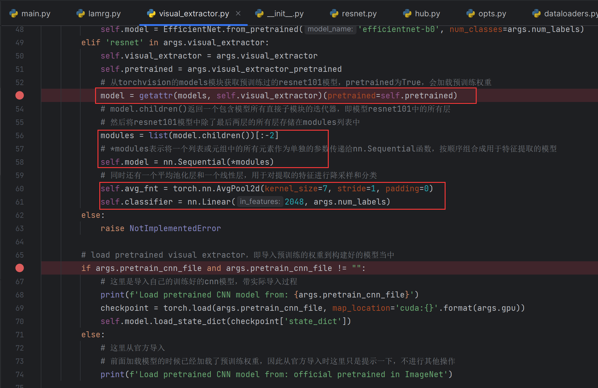

2. 关于平均池化(<font color="red">以后可以细看一下</font>)：

   1. 平均池化的作用如下：

      

   2. `torch.nn.AvgPool2d(kernel_size=7, stride=1, padding=0)`函数解析如下：

      

3. 关于从官方下载并加载`resnet`模型，使用这句话来加载官方的模型和权重：`model = getattr(models, self.visual_extractor)(pretrained=self.pretrained)`

   1. `models`是`torchvision`下面的包，其中有一个`init`函数，如下图所示

      

   2. 进入`resnet`包，其中提供了各个`resnet`模型的权重的下载链接(如下第一张图)，通过代码调试，发现下载好的权重的存储位置(如下第二张图)

      

      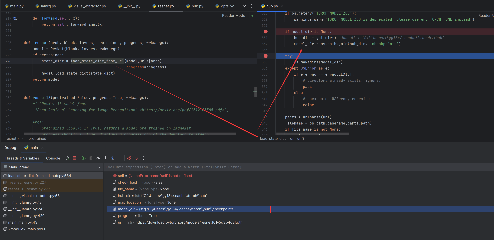

      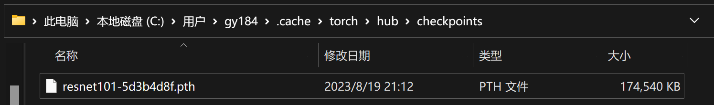

##### 3.1.3.1.2 encoder_decoder的创建

1. 使用`TransformerModel`类创建编码器解码器结构时，涉及到好几个类之间的继承，如下图所示，`TransformerModel`继承自`AttModel`，进一步继承自`CaptionModel`，最终继承自`nn.Module`。

   

2. 关于python类的继承：

   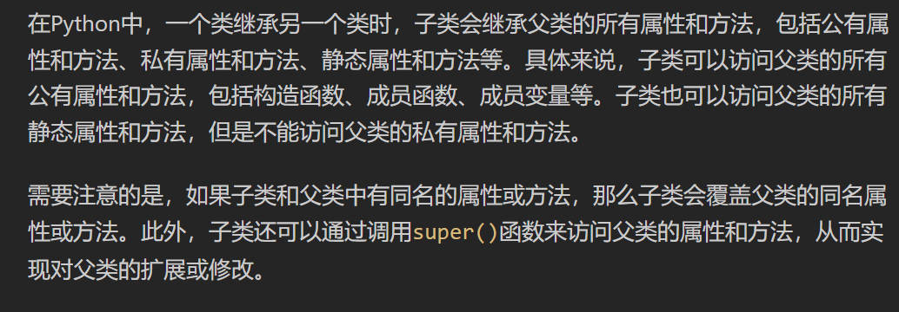

3. 进入`CaptionModel`的初始化函数，没有什么额外的属性定义

   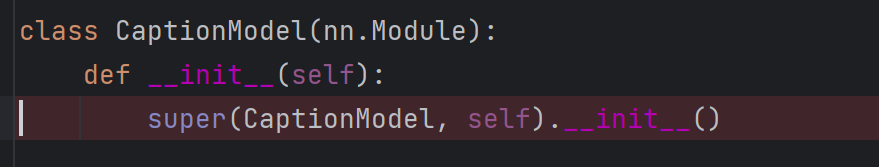

4. 然后进入`AttModel`的初始化函数，定义了注意力模型的一些参数，如下图所示

   

5. 之后才进入到transformer的模型构建当中：

   1. 编码器层和解码器层都是`opt.num_layers=3`，特征维度是`opt.d_model=512`，其余的参数如下图所示

      

   2. 然后创建一个序列用于对特征进行嵌入操作(感觉顶多算一个线性变换，将特征的维度从`self.att_feat_size`变成`self.d_model`)，序列中

      1. **首先**是一个批次标准化层（<u>可选，这里默认不进行此操作</u>），输入特征的维度是`self.att_feat_size=2048`

      2. 其次是一个线性层，输入特征维度是`self.att_feat_size`，输出维度是`self.d_model=512`

      3. 然后是一个`Dropout`层。如下图所示是建立好的`nn.Sequential`

         

      4. 关于`nn.BatchNorm1d`标准化层

         

      5. 关于`nn.Sequential(*(......))`

         1. `*`号用于对其后面的元组`(......)`进行解包，将其中的每个元素传递给`nn.Sequential`

         2. 之所以把`(nn.BatchNorm1d(self.att_feat_size))`写成`(nn.BatchNorm1d(self.att_feat_size),)`，是因为现成前者的话无法识别为元组，也就无法与后面的`(nn.Linear(self.att_feat_size, self.d_model),nn.Dropout(self.dropout))`相加了。下图是一个测试例子

            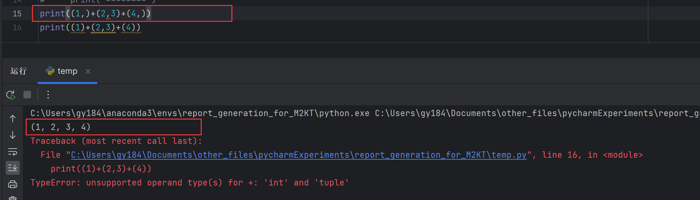

         3. 所以也可以把这几个层单独拎出来写，就像下图给出的官方的例子一样

            
   
   3. 然后构建了一个线性层，输入是模型的特征`d_model`，输出维度是目标词汇表的大小`tgt_vocab`
   
   4. 然后传入超参数，构建transformer模型
   
      1. 和之前看的transformer代码基本一样
   
      2. 唯一的区别在于下图：`src_embed`不再是输入序列的`Embeddings`了，因为本论文中输入是图像了，会有额外的对图像的操作
   
         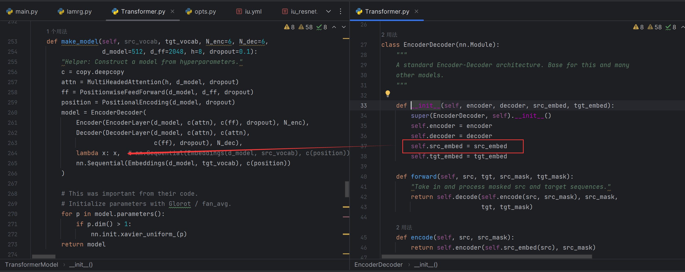
      
      3. 所以看最后建立的`EncoderDecoder`类，结构中并没有`src_embed`，只有`tgt_embed`，所以`lambda x: x`真的只是一个占位符
      
         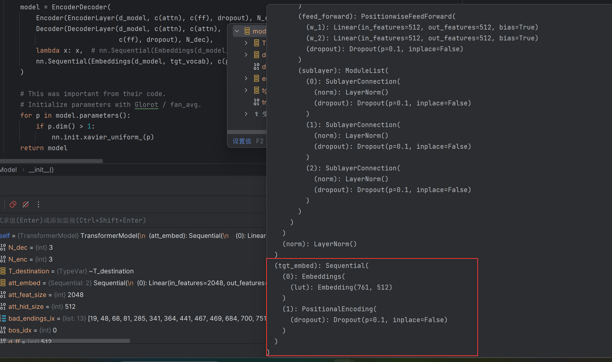

##### 3.1.3.1.3其他

1. 然后创建了一个线性层，输入是疾病标签数(`14`种观察结果)，输出是`d_vf`(应该是视觉特征的维度吧？，不过是用于`densenet`或者`efficientnet`的，`main.py`中使用的是`resnet101`)

   

2. 并对这个线性层进行人为的初始化操作

   1. 使用`nn.init.kaiming_normal_`函数对创建的线性层的随机初始化得到的权重进行处理，具体如下图所示

      

   2. 使用`f.bias.data.fill_(0)`将偏置都变成`0`

   3. 最终前后对比，如下图所示

      

#### 3.1.3.2调用`LAMRGModel_v9`类的初始化函数

> 1. 从`_LAMRG`类继承过来之后，其中的成员属性和函数也被继承过来，因此目前已经具备分词器`tokenizer`、视觉特征提取器`visual_extractor`、transformer的编码器解码器结构`encoder_decoder`

1. 首先是一些基本的参数的设置

   1. 其中关于`num_slots`，<font color="red">目前还不知道是什么意思</font>

   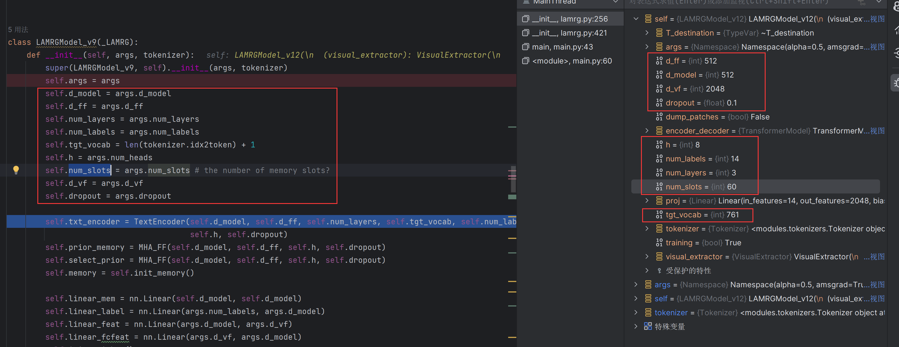

##### 3.1.3.2.1`TextEncoder`的创建

> 1. 用途：用于对报告文本的编码

1. `TextEncoder`包含如下内容：

   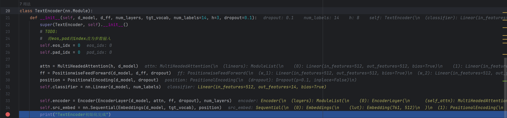

   1. 用于对报告文本进行编码的编码器：和前面创建的transformer模型的编码器结构是一样的。虽然某些参数名称不一样，但使用的数值是一样的

      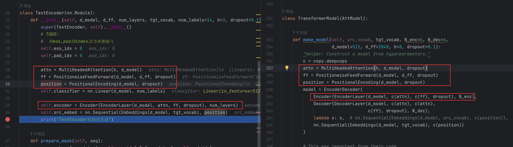

   2. 一个分类器(<font color="red">用途目前不清楚？</font>)，从`d_model`到`14`种观察结果`num_labels`

   3. 一个对报告文本的嵌入层：由于报告文本在此任务中是需要生成的内容，因此词汇表是用`tgt_vocab`来代表的，而此处是对输入的报告文本进行编码，因此嵌入的结果用`src_embed`来表示。

      

##### 3.1.3.2.2`memory`的创建

> 1. memory应该就是论文中说的知识库

1. <font color="red">尚不清楚`self.prior_memory`和`self.select_prior`的作用？</font>

2. `self.prior_memory`和`self.select_prior`本质上都是一个多头注意力层+一个残差连接层，如下图所示

   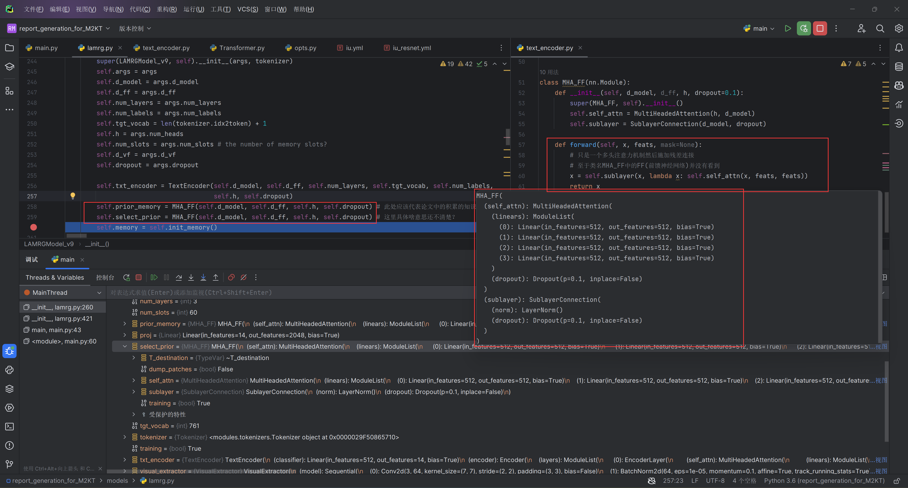

3. 然后初始化记忆矩阵(<font color="red">尚不清楚如何发挥作用，后续再看</font>)，初始化的过程为(如下图所示)：

   1. 用参数矩阵(是一个单位矩阵)来表示记忆矩阵
   2. 然后根据`d_model`和`num_slots`之间的大小关系，对参数矩阵进行0填充或者截断
   3. 然后构建一个`mask`矩阵，维度是`(num_slots, d_model)`，前`num_slots`列为`1`，其余为`0`
   4. 注意：由于最初是调用`LAMRGModel_v12`来构建模型的，而`LAMRGModel_v12`又继承了`LAMRGModel_v9`，两个类都有`init_memory`函数，因此`LAMRGModel_v12`重写了`LAMRGModel_v9`的`init_memory`函数，所以即使是在递归调用`LAMRGModel_v9`的初始化函数的时候，初始化记忆矩阵使用的是重写之后的`init_memory`函数，即`LAMRGModel_v12`中的`init_memory`函数。

   

##### 3.1.3.2.3其他

1. 创建了四个不同输入输出组合的线性层(<font color="red">用于不同的地方，目前不清楚？</font>)，并手动初始化其中的三个

   

#### 3.1.3.3调用`LAMRGModel_v12`类的初始化函数

> 1. 初始化函数中基本的参数设置与`LAMRGModel_v9`一样，不同之处在于：
>    1. `memory`相关的设置
>    2. 线性层的设置
>    3. 增加了分类器和标签嵌入

##### 3.1.3.3.1`memory`相关的设置

> 1. 与`LAMRGModel_v9`相比，增加了`update_memory`属性，重写了`select_prior`属性

1. 新增的`update_memory`和之前的`prior_memory`以及要重写的`select_prior`一样，都是`MHA-FF`类，即都是一个多头注意力机制然后施加残差连接

   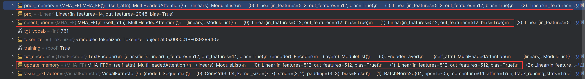

2. 进一步的，在参数设置上，三者完全一样，虽然`update_memory`和重写的`select_prior`的`head`参数变成了`args.num_memory_heads`，但是`args.num_memory_heads`和`args.num_heads`默认值是一样的

3. 在`memory`的初始化方面，在`LAMRGModel_v12`类中，对在`LAMRGModel_v9`类中初始化出来的`self.memory`进行了重写，即重新调用`self.init_memory()`函数，并将返回的`memory`和`mask`分开存放

   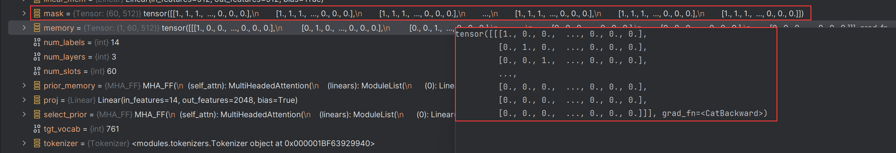

##### 3.1.3.3.2线性层的设置

1. 与`LAMRGModel_v9`类相比，多了`self.get_mem`、`self.linear_z`线性层，并重写了`self.linear_feat`(其实重写之后还是原来那个)

   

##### 3.1.3.3.3其他

1. 分类器

   1. 构建了一个输入是`d_model`，输出是`14`种观察结果的`num_labels`

2. 标签嵌入层

   1. 是一个线性层，输入是`1`，输出是`d_model`
   2. 即将某一个标签映射到`d_model`的特征维度上

   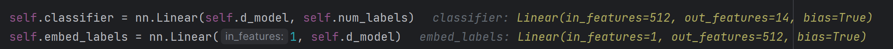

3. 手动初始化上面建立的线性层、分类器、标签嵌入层

   1. 在初始化权重函数内部，调用的是`_LAMRG`类中的`_init_weight`函数，既调整了权重，也将偏置置为`0`

      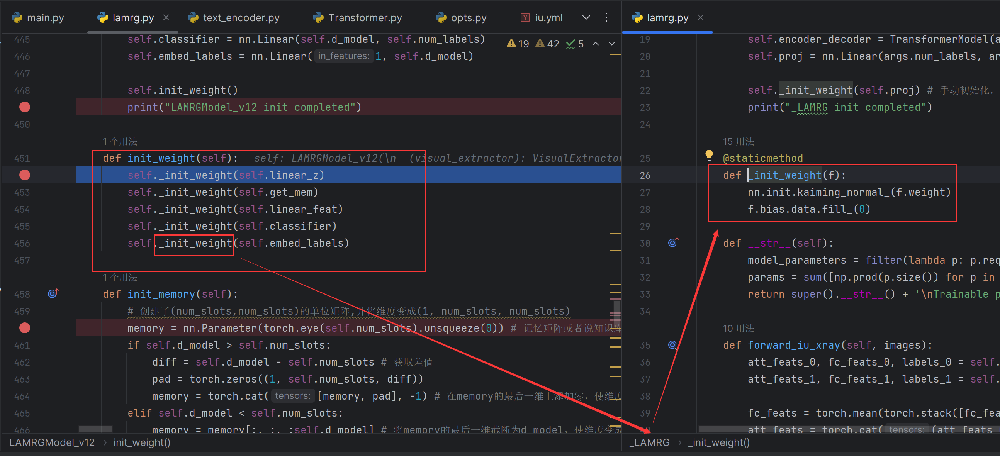

#### 3.1.3.4模型创建结果

1. 至此就完成了模型的创建，结果如下图

   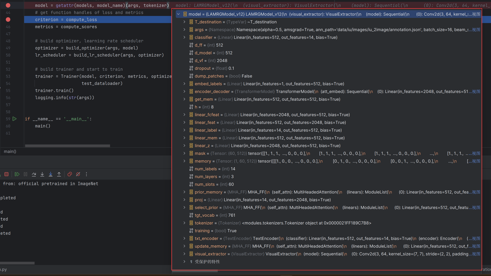

### 3.1.4创建损失函数和评价矩阵

1. 下图中的写法只是给函数起了别名，方便理解，<font color="red">具体内部怎么计算的，等计算的时候再描述</font>

   

### 3.1.5构建优化器和学习率调度器

> 1. 优化器用于模型参数的更新，学习率调度器用于动态调整参数更新过程中学习率的值

#### 3.1.5.1优化器

1. 这里将模型参数划分成视觉特征的参数、视觉特征以外的其它参数

   1. 两类参数的初始学习率不同

   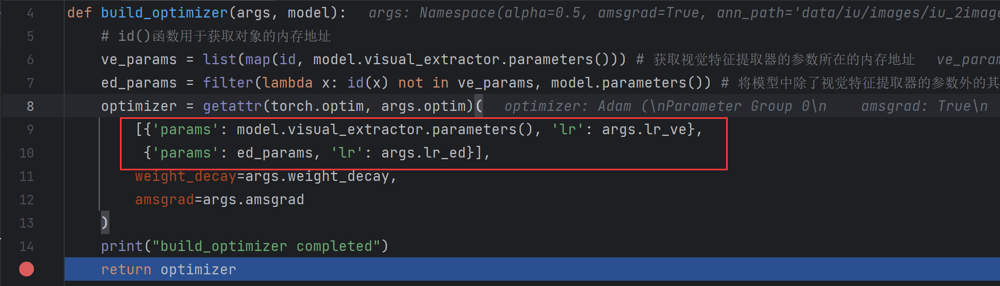

   

#### 3.1.5.2调度器

1. 这里采用的调度器是`StepLR`或者余弦退火，默认是`StepLR`

2. <font color="red">以后可以详细看一下调度器的内容</font>

   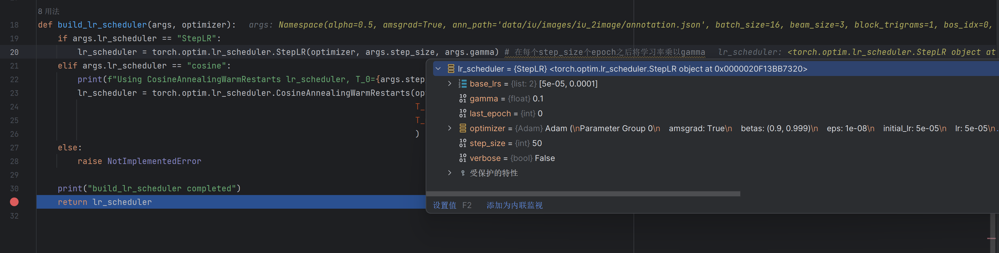

   

### 3.1.6构建Trainer用于训练管理

> 1. `Trainer`类继承了`BaseTrainer`类，因此调用`Trainer`的初始化函数之前，会先调用`BaseTrainer`类的初始化函数

#### 3.1.6.1tensorboardX相关知识

1. `tensorboardX`是一个PyTorch的可视化工具库，用于将PyTorch中的训练过程可视化。
   1. `tensorboardX`可以将PyTorch中的训练日志数据写入到TensorBoard可视化工具中，从而可以方便地查看模型的训练过程和性能指标。

2. `tensorboardX`库提供了一个`SummaryWriter`类，用于将训练日志数据写入到TensorBoard中。
   1. 通过在训练过程中调用`SummaryWriter`类的方法，可以将模型的损失函数、精度、学习率等指标写入到TensorBoard中，从而可以方便地查看这些指标的变化趋势和相互关系。

3. 此外，`tensorboardX`还支持可视化模型结构、梯度直方图、图像、音频等数据，可以帮助用户更加全面地了解模型的训练过程和性能表现。

#### 3.1.6.2调用`BaseTrainer`类的初始化函数

1. 记录参数信息：使用`self.print_args2tensorbord()`遍历了 `self.args` 中的所有参数，并将它们的名称和值以文本的形式添加到 TensorBoard 中

   1. 文件位置：下图框出来的是`SummaryWriter`将数据保存的位置

      

2. 设置GPU，关键点：

   1. 将张量分配到GPU上；这里直接用`device = torch.device('cuda:0' if n_gpu_use > 0 else 'cpu')`将张量分配到第一个GPU上，<font color="red">如果是多GPU时，后续应该还会有其他的相应操作吧？</font>
   2. 多GPU时对模型的处理：`self.model = torch.nn.DataParallel(model, device_ids=device_ids)`
   3. 本文默认使用一个GPU进行训练

   

3. 其它参数，如下图所示。其中：

   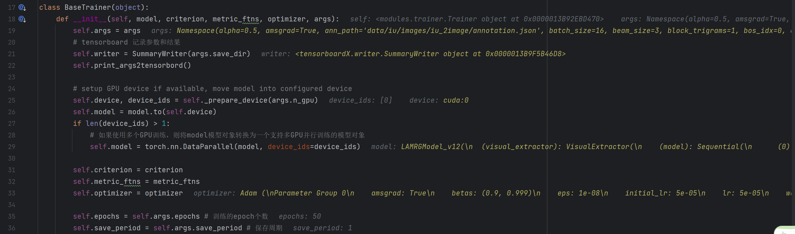

   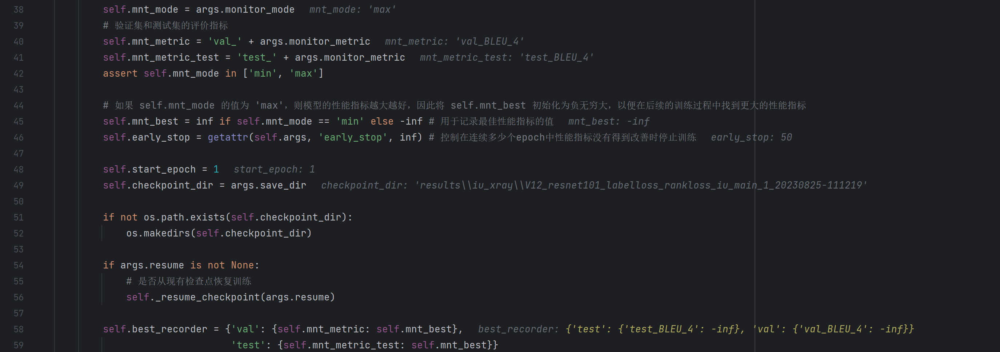
   
   1. `self.mnt_mode = args.monitor_mode`：所监视的指标的模式，有两个选择：最大化或者最小化。解释如下；简单说来就是告诉模型用什么类型的指标监视模型的训练情况
   
      

#### 3.1.6.3调用`Trainer`类的初始化函数

1. 在基类的基础上，这里只需要记录一下下面四个量：

   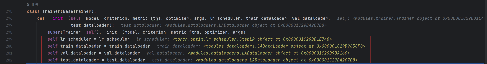

### 3.1.7开始训练过程

> 1. `trainer`对象将调用从基类`BaseTrainer`中继承过来的`train`方法，在`train`方法中，有语句`result = self._train_epoch(epoch)`，此语句将调用`Trainer`类实现的`_train_epoch`方法(在基类`BaseTrainer`中，`_train_epoch`方法是一个抽象方法，必须在子类中进行实现，否则会报错)

#### 3.1.7.1`_train_epoch`方法的实现过程

1. 第一部分：将模型设置为训练模式，创建记录损失的变量，以及一个进度条(基于`train_dataloader`创建，用于展示训练数据的加载进度，而训练时数据又是训练一批加载一批，因此也就是用于展示训练进度了)；如下图所示

   1. 进度条范围是`0~130`，正好符合训练数据加载器需要采样`130`次

   

2. 然后在执行`for batch_idx, (images_id, images, reports_ids, reports_masks, labels) in enumerate(t):`语句时会去读取第一批数据。

   1. 先进行数据的读取，见：[3.1.7.1.1数据的读取之getitem方法](#3.1.7.1.1数据的读取之getitem方法)
   2. 再进行数据的处理，见：[3.1.7.1.2数据的处理之collate_fn方法](#3.1.7.1.2数据的处理之collate_fn方法)

3. 获取到数据之后，将其转移到GPU上

   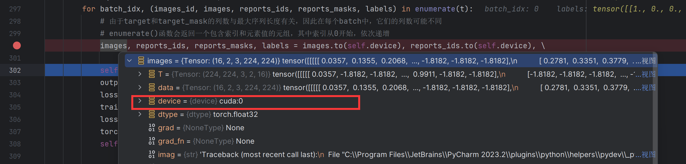

4. 然后将优化器重的梯度清零：`self.optimizer.zero_grad()`

5. 然后将图像数据、报告数据、标签数据传入模型，如下图所示；进行模型的前向计算(见：[3.1.7.1.3LAMRGModel_v12模型的前向计算](#3.1.7.1.3LAMRGModel_v12模型的前向计算))

   

6. 接下来，进行损失的计算，详见[4.1损失计算过程](#4.1损失计算过程)小节。

7. 损失计算完成后，将损失计算得到的值加入到训练损失的累加器`train_loss`中， 并进行反向传播，传播到计算过程中的各个量中

   

8. 然后使用`torch.nn.utils.clip_grad_value_`函数进行梯度裁剪，防止梯度爆炸，具体作用如下图所示：

   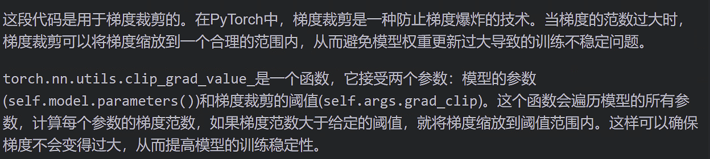

9. 然后更新参数(所以这里每一批数据都进行梯度更新，不像transformer那篇文章那样，是累计几次之后再更新)

10. 然后使用`tqdm`库的`set_description()`方法设置进度条的描述信息，可以看到下图中红框的位置加上了损失信息

    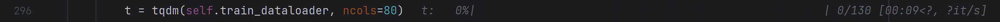

    

11. 以上是一个批次的数据需要进行的所有操作，每处理一个批次的数据，都会得到一个损失值，会在进度条中显示出来，如下图所示是两次连续的进度条的变动情况：

    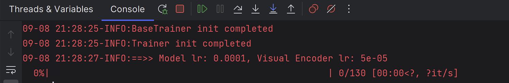

    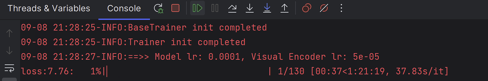

    

12. 将所有批次的数据训练完之后，会计算一下平均损失：

    

13. 接下来，使用验证集和测试集评估一下这个epoch下的模型。详见[4.2当前epoch下对模型进行验证](#4.2当前epoch下对模型进行验证)。当前epoch的测试过程和验证过程一样，就是使用的是测试集而已。

14. 评估完成之后，将验证和测试过程中的指标值存到日志当中；然后使用`self.lr_scheduler.step()`更新学习率

15. 至此，当前epoch执行完毕，返回日志对象(本质上是一个字典)到<a href="#anchor8">`BaseTrainer`的`train`方法</a>

    1. 对应到`BaseTrainer`的`train`方法中，就是下图所示的`result`
    2. `result`包含训练损失、验证和测试的指标结果

    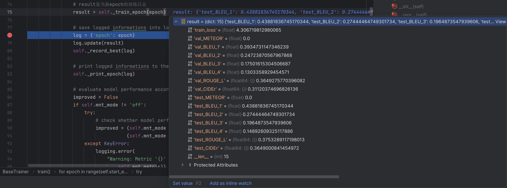

##### 3.1.7.1.1数据的读取之getitem方法

> 1. `getitem`方法位于`datasets.py`文件的`IuxrayMultiImageDataset`类中
>
> 2. torch里面的方法在fetch数据的时候，需要调用多次`getitem`方法，每调用一次`getitem`方法，就读取了一条数据
>
> 3. <font color="red">这里有一个问题，每次fetch数据的时候都只读取前两张图像，但是有的患者文件夹中存在2张以上的图像，因此直接这样读取的话，2张以外的图像就没用了，而且存在读取的两张图像，有的是两个视角的图像，有的则不是</font>。
>
>    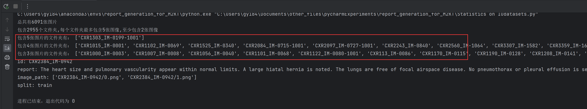

1. 首先pytorch框架会采样一个索引值，作为`idx`参数传递进入`getitem`方法，例如此时是`956`

   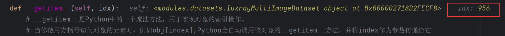

2. 然后，获取此索引值对应的一条数据，并获取该条数据中的患者id、图像路径，然后读取对应的图像数据，并按照之前设定的变换方法对读取进来的图像进行变换

   1. 下图是变换前的图像数据，格式还是一个`PIL.Image.Image`对象

      

   2. 然后使用下图所示的变换进行变换操作：

      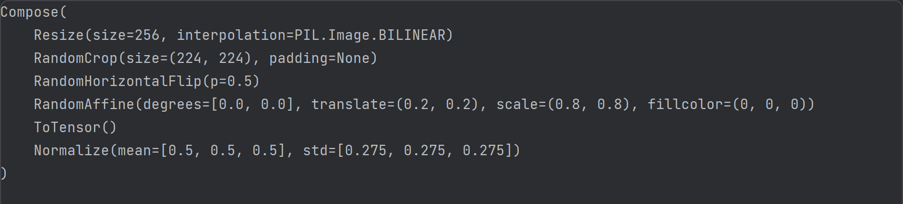

   3. 变换之后的图像数据如下图所示：维度是`(3,224,224)`，其中，`3`代表`3`个通道，即RGB通道，`224`代表图像的维度是`224*224`

      

3. 接着，将两张图像的数据进行堆叠，作为最终的图像数据。如下图所示：维度是`(2,3,224,224)`

   

4. 然后获取了该条数据的报告文本对应的词典索引值、掩码矩阵、报告文本的长度（包含开始和结束符），如下图所示

   

5. 然后，读取该条数据对应的标签列表

   1. 源代码中，先获取了该条数据的患者id中的数值部分，然后去字典中读取标签，由此可知，其标签文件的id列是数值，这与我自己构建的标签文件的第一列不同(我自己的第一列就是完整的id字符串)，因此需要修改

      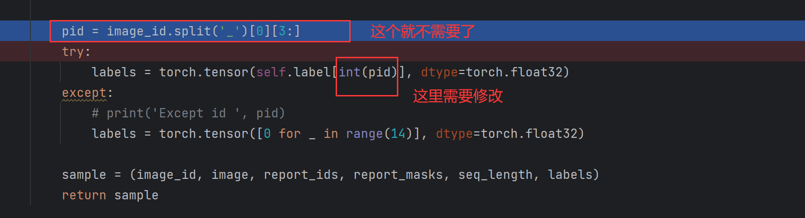

   2. 修改之后如下图所示

      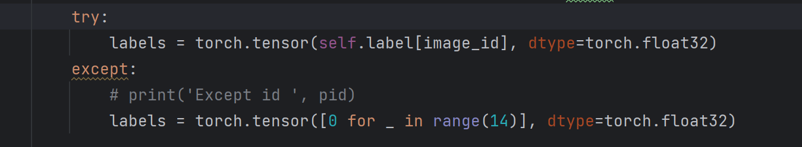

6. 最后以元组形式返回：`(患者id、堆叠后的图像张量、报告文本对应的索引值、报告掩码张量、报告长度、标签张量)`，如下图所示

   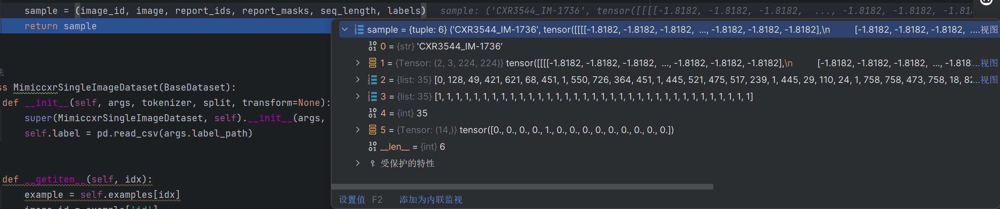

##### 3.1.7.1.2数据的处理之collate_fn方法

> `collate_fn`方法用于数据(一批数据)读取进来之后的一些后处理操作；

1. torch读取进来的一批数据以列表形式存储在一起，列表中每个元素就是`getitem`方法返回的一个元组，`16`就是`batch_size`。如下图所示

   

2. 对这一批数据进行解包：

   1. 解包得到这批数据对应的患者id，如下图所示：

      

   2. 解包得到这批数据对应的图像数据，是一个元组，其中每个元素就是之间在`getitem`方法中堆叠得到的两张图像数据组成的张量。如下图所示：

      

   3. 解包得到这批数据对应的报告文本在词典中的索引值，如下图所示：

      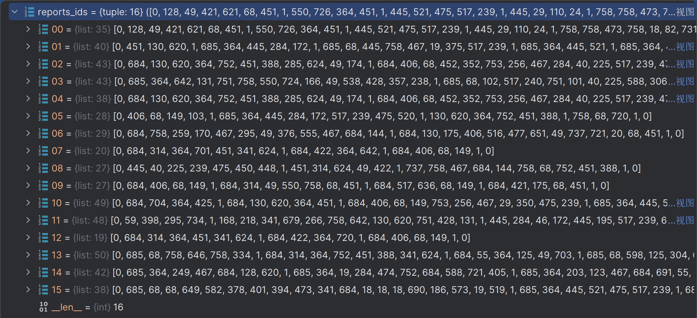

   4. 解包得到这批数据对应的报告文本的掩码张量，如下图所示：

      

   5. 解包得到这批数据对应的报告文本的长度，如下图所示：

      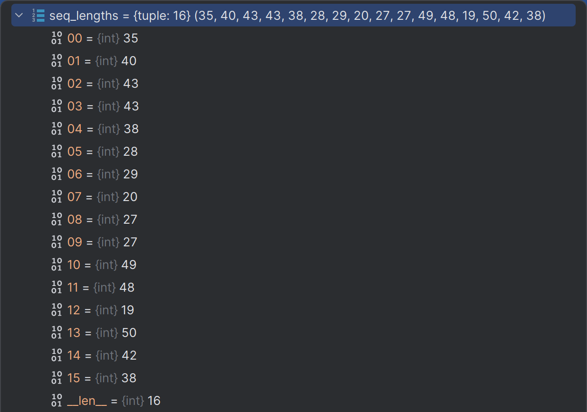

   6. 解包得到这批数据对应的疾病标签数据，如下图所示：

      

3. 然后将这批数据堆叠在一起，得到最终的图像数据张量，维度是`(16,2,3,224,224)`，如下图所示；

   

4. 接着获取本批次数据报告文本的最大序列长度

   

5. 然后构建目标以及目标掩码张量(这里是报告生成任务，因此报告文本就是目标)，并将报告文本的索引值赋给目标

   1. 如下图是初始化的目标张量、目标的掩码张量，维度都是`(batch_size,max_seq_length)`，这里则是`(16,50)`。注意：由于报告文本的索引序列在生成的时候如果不超过设置的最大序列长度，则会原样保留，也就是说长度可能会不一样，因此这里的`50`只是一种情况。

      

   2. 接着，将这一批数据的报告索引值以及报告掩码矩阵赋值给新创建的`targets`、`targets_masks`；因此这里构建`targets`、`targets_masks`的目的就是以符合模型输入的格式重新组织模型的目标数据

      

      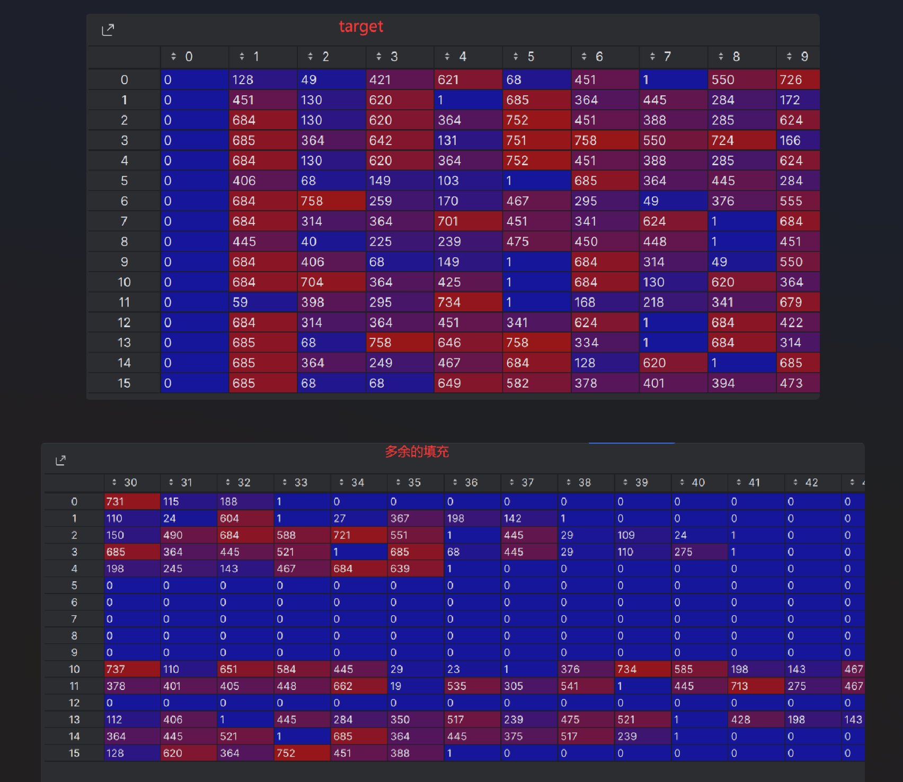

      

   3. 然后将这批数据的标签数据进行堆叠，堆叠前这批数据的标签数据是一个元组，长度为`16`；每个元素是一个`一维`的长度为`14`的张量；堆叠之后的维度变为：`(16,14)`

      

   4. 最后，将结果返回到`for batch_idx, (images_id, images, reports_ids, reports_masks, labels) in enumerate(t):`语句(因此返回去的数据都是经过处理且在存储的形式和维度上都比较符合模型输入的要求的数据)；返回的时候还做了如下处理：

      1. 将`targets`转换成长整型，将`targets_masks`转换成浮点型
      2. 将`targets`和`targets_masks`都转换成Tensor类型的张量

      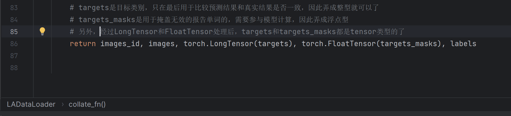

##### 3.1.7.1.3LAMRGModel_v12模型的前向计算

> 1. 调用顺序：调用`LAMRGModel_v12`的`forward`方法
>    1. 调用`_LAMRG`的`forward_iu_xray`方法，用于提取图像特征、平均池化特征、预测标签；以及对提取出来的特征的处理
>    1. 基于综合了(即求平均)两张图片平均池化特征的`avg_feats`生成视觉标签

###### 3.1.7.1.3.1图像特征的提取

> 1. 在`_LAMRG`的`forward_iu_xray`方法中，调用`visual_extractor`中的`forward`方法
> 2. 平均池化是对整个图像进行的

1. 首先使用`resnet101`模型对图像进行特征提取(<font color="red">以后可以详细看一下`resnet101`模型</font>)，得到特征`patch_feats`，维度为：`(16,2048,7,7)`

   

   1. `16`：表示这个张量是一个`batch size`为`16`的张量，即有`16`张图片被同时输入到模型中进行特征提取

   2. `2048`：表示每张图片提取出来的特征向量的维度为`2048`，这个维度是由`ResNet101`模型的最后一个卷积层决定的

      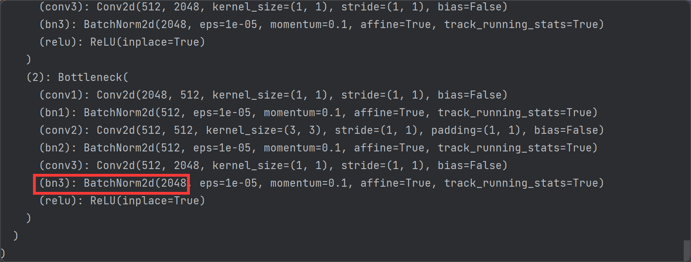

   3. 第三个维度和第四个维度表示每个特征向量的维度，即`7x7`的像素块

2. 接着，使用平均池化提取缩减后的特征图：

   1. `self.avg_fnt(patch_feats)`：由于平均池化在设置的时候`kernel_size=7`，因此每次池化的区域大小是`7x7`的像素块，与`resnet101`提取的特征的大小一致，因此平均池化之后的维度就变成了`[16, 2048, 1, 1]`

   2. 然后使用`squeeze`方法去除多余的维度，就变成了`[16,2048]`

   3. 然后使用`reshape`函数改变维度，但其实维度上没有变化，依旧是`[16,2048]`。但是`reshape`以及前面的`squeeze`操作之后(<font color="red">为什么要进行`reshape`，维度没变化啊？</font>)，就包含了两个梯度函数(<font color="red">两个梯度函数有啥区别，没有`reshape`行不行？</font>)，如下图所示。

      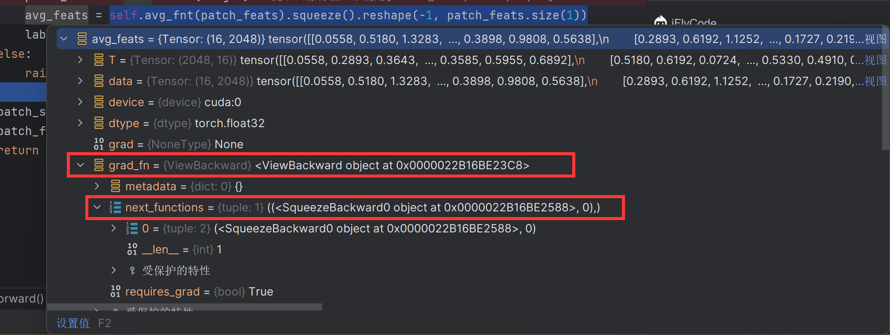

   4. 整个过程的拆解如下图所示。

      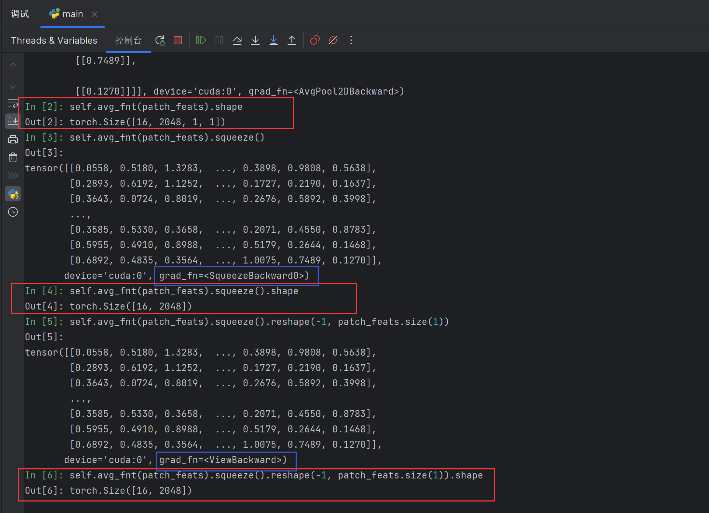

3. 然后将<u>平均池化之后的特征</u>输入到分类器中，来预测图像所属的疾病标签类别。这里`labels`的维度是`[16,14]`结合论文，<u>此处预测疾病标签类别的作用是：用于后续计算标签损失</u>。

   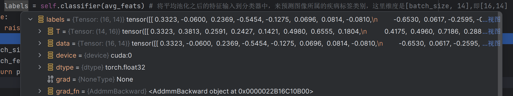

4. 最后，改变了`patch_feats`的维度，从`[16,2048,7,7]`变成了`[16,49,2048]`；然后返回提取的图像特征、平均池化之后的特征、根据平均池化特征预测出来的图像所属的疾病标签类别

   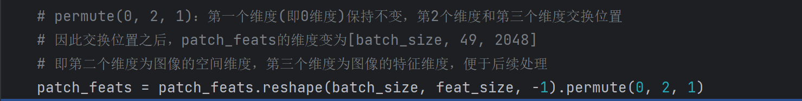

###### 3.1.7.1.3.2特征提取后的处理

> 1. 每条数据提取两张图像的特征

1. 首先，对这批数据中的每一条数据，对两张图片的平均池化特征<u>求平均</u>，得到综合的平均池化特征，维度是`(16, 2048)`

2. 其次，对这批数据中的每一条数据，将两张图片提取出来的特征在空间维度(即第`1`维度)进行<u>拼接</u>，得到综合特征，维度是`(16, 98, 2048)`，含义：`16`条数据，每条数据`98`个像素区域，每个区域的特征维度是`2048`

3. 最后，对这批数据中的每一条数据，将两张图片的预测标签在第`0`维度上进行平均，将平均之后的标签作为对当前患者的疾病标签的预测结果，维度是`(16, 14)`

4. 这一过程如下图所示

   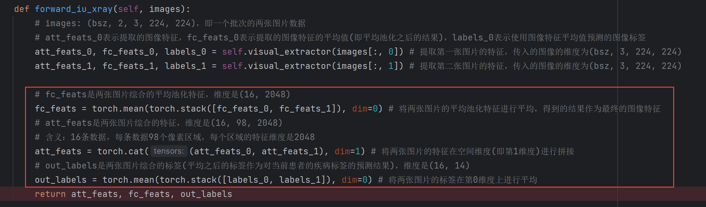

###### 3.1.7.1.3.3视觉标签的生成

1. 使用综合了(即求平均)两张图片平均池化特征的`avg_feats`，经由线性层由`(16,2048)`投影到`(16,512)`的`z_img`
2. 然后使用类似的线性分类器输出疾病标签的预测结果，维度依然是`(16,14)`
3. 相较于前面直接将两个单张图片的疾病标签预测结果进行平均，这个方法更加鲁棒一点

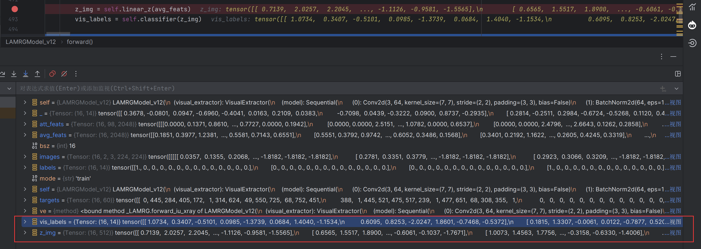

###### 3.1.7.1.3.4当前memory的获取

1. 对当前的`self.memory`进行类型转换(包括数据类型以及设备类型），然后进行线性变换(即获取`memory`的过程)，然后进行维度扩展，扩展成`16`条数据的`memory`(扩展的过程是对原先一条数据的`memory`进行复制)

   1. 原先`self.memory`是在cpu上的，数据类型与`images`一致，都是`float32`，转换之后，到了GPU上；

      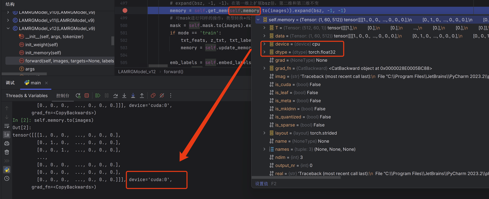

   2. 然后使用`self.get_mem`获取`memory`，即对`memory`进行<u>线性变换</u>，线性变换前后的维度没有变化，如下图所示

      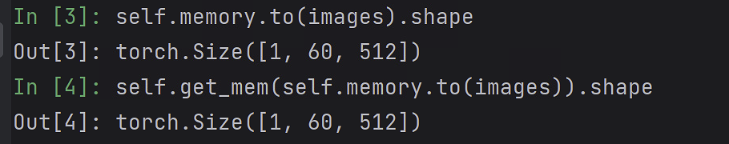

   3. 然后进行维度扩展，如下图所示，`16`条数据的`memory`是一样的

      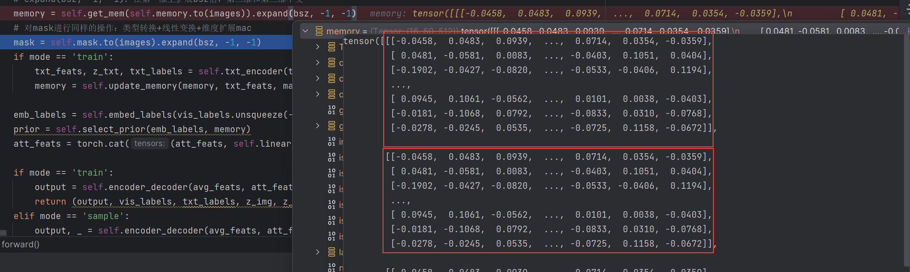

2. 对`mask`进行同样的操作：类型转换+线性变换+维度扩展，最终的维度是`(16,60,512)`。

###### 3.1.7.1.3.5报告文本的编码

> 1. 包括构建报告文本的掩码张量(用于报告文本编码时多头注意力计算中的掩码张量)、对报告文本进行编码、获取汇总的报告文本信息、依据获取的报告文本信息预测疾病标签类别

1. 对这批报告文本序列(维度是`[16,max_seq_length]`)构建掩码张量：维度与报告序列维度相同，也是`[16,max_seq_length]`；然后将掩码张量中每条数据的第一个掩码值设置为`1`，表示开始位置；然后给掩码张量增加维度，变成`[batch_size, 1, seq_len]`；如下图所示

   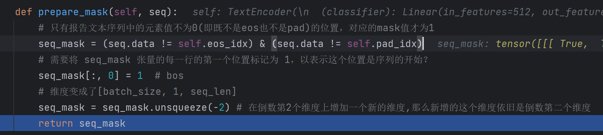

   

2. 对报告文本进行编码、获取汇总的报告文本信息、依据获取的报告文本信息预测疾病标签类别，如下图所示；在这个批次数据中：

   1. 报告文本编码之后的`txt_feats`的维度是：`[16,60,512]`
   2. 汇总的报告文本信息的`z_txt`的维度是：`[16,512]`
   3. 预测的疾病标签的`txt_labels`的维度是：`[16,14]`

   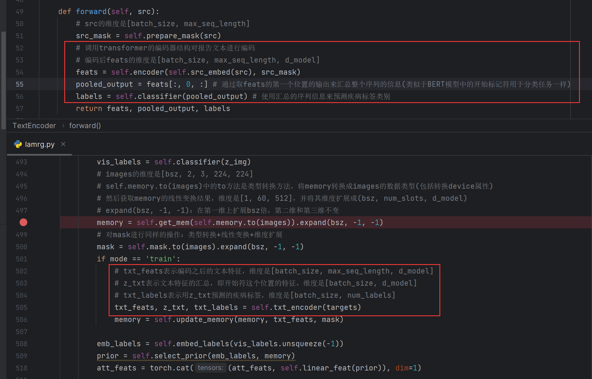

###### 3.1.7.1.3.6对memory进行更新

> 1. 执行`self.update_memory`之后将依次调用：`MHA_FF`类的`forward`方法$\rightarrow$`SublayerConnection`类的`forward`方法$\rightarrow$`MultiHeadedAttention`类的`forward`方法$\rightarrow$`attention`方法
> 2. 另外，虽然通过`self.update_memory(memory, txt_feats, mask)`语句将`memory`的掩码张量`mask`张量传入了，但是在`MHA_FF`类的`forward`方法中，执行`self.self_attn(x, feats, feats)`时并没有继续传入`mask`，因此这里`memory`的`mask`张量没有派上用场。

1. 进入`MHA_FF`类的`forward`方法之后，将会进入多头注意力机制层，这里`query`张量是记忆矩阵`memory`，`key`和`value`张量都是文本特征，<u>与论文中的图示相符合</u>；如下图所示

   1. 这里发现：因为需要更新的是`memory`，这里就把`memory`作为了查询`query`张量(<font color="red">后续还需要深度理解一下注意力机制三个量的具体含义</font>)
   2. `memory`更新的理解：<u>这里的知识库更新，是让知识库记忆矩阵去注意新的一批数据中的报告文本的特征</u>。

   

   

2. 经过多头注意力层之后，得到更新了的`memory`。更新前后的维度不变，都是`[batch_size, num_slots, d_model]`，这里是`[16,60,512]`


###### 3.1.7.1.3.6 visual-knowledge attention

> 1. 先对标签嵌入进行线性变换，然后与`memory`一起执行注意力层，然后将之前提取的视觉特征与经过attention的标签嵌入连接起来，得到所谓的注意过`memory`的视觉特征
> 2. 最后可以把标签嵌入和图像特征连接起来作为注意了知识库的视觉特征，是因为这里的标签嵌入是由视觉特征线性变换而来，本质上还是视觉特征。

1. 对标签嵌入进行线性变换，维度从`vis_labels`的`[16,14]`变成`emb_labels`的`[16,14,512]`

   

2. 然后调用`self.select_prior`方法(本质上是一个多头注意力层`MHA_FF`)，将当前的`memory`与标签嵌入做注意力操作，得到注意过知识库(记忆矩阵)的标签嵌入；维度保持不变，从`emb_labels`的`[16,14,512]`到`prior`的`[16,14,512]`

   1. 与更新`memory`时的注意力类似，这里是要让标签嵌入去注意记忆矩阵，因此标签嵌入`emb_labels`就作为了查询张量`query`

   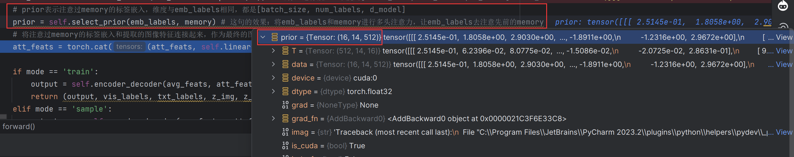

3. 最后，将前面提取的图像特征与这里注意过知识库的标签嵌入`prior`连接起来，得到所谓的注意过`memory`的视觉特征，作为最终的图像特征；先对`prior`进行线性变换是为了将`prior`的最后一个维度变成和`att_feats`一样，即将`prior`的维度变为`[16,14,2048]`

   1. 连接前，`att_feats`的维度是`[16,98,2048]`；在第一个维度进行连接，连接后维度变成`[16, 98+14, 2048]`

   

###### 3.1.7.1.3.7使用encoder_decoder计算输出

> 1. 调用过程：一般来说，pytorch中，通过对象名称直接传入参数，会调用该对象中的`forward`方法；这里的`encoder_decoder`对象是一个`TransformerModel`类，因此也是这种逻辑
>
> 2. `TransformerModel`类继承自`AttModel`，进一步继承自`CaptionModel`，而`CaptionModel`中有`forward`方法，因此首先会进入`CaptionModel`的`forward`方法，如下图所示；由于这里的`forward`方法中有一个`**kwargs`可以接收关键字参数，因此`output = self.encoder_decoder(avg_feats, att_feats, targets, mode='forward')`中增加`mode='forward'`也就不奇怪了
>
>    1. 通过`mode = kwargs.get('mode', 'forward')`获取`mode`关键字的值，然后通过调用对应的函数，这里就是去调用`TransformerModel`类的`_forward`方法
>
>    
>
> 3. 因此，总的调用过程为：`TransformerModel`类$\rightarrow$`CaptionModel`中的`forward`方法$\rightarrow$`TransformerModel`类的`_forward`方法

1. 编码器解码器模块是一个transformer模型(创建过程详见[3.1.3.1.2 encoder_decoder的创建](#3.1.3.1.2 encoder_decoder的创建))，结构如下：

   ```python
   TransformerModel(
     (att_embed): Sequential(
       (0): Linear(in_features=2048, out_features=512, bias=True)
       (1): Dropout(p=0.1, inplace=False)
     )
     (logit): Linear(in_features=512, out_features=761, bias=True)
     (model): EncoderDecoder(
       (encoder): Encoder(
         (layers): ModuleList(
            # ...编码器层有3个，此处只显示最后一个编码器层...
           (2): EncoderLayer(
             (self_attn): MultiHeadedAttention(
               (linears): ModuleList(
                 (0): Linear(in_features=512, out_features=512, bias=True)
                 (1): Linear(in_features=512, out_features=512, bias=True)
                 (2): Linear(in_features=512, out_features=512, bias=True)
                 (3): Linear(in_features=512, out_features=512, bias=True)
               )
               (dropout): Dropout(p=0.1, inplace=False)
             )
             (feed_forward): PositionwiseFeedForward(
               (w_1): Linear(in_features=512, out_features=512, bias=True)
               (w_2): Linear(in_features=512, out_features=512, bias=True)
               (dropout): Dropout(p=0.1, inplace=False)
             )
             (sublayer): ModuleList(
               (0): SublayerConnection(
                 (norm): LayerNorm()
                 (dropout): Dropout(p=0.1, inplace=False)
               )
               (1): SublayerConnection(
                 (norm): LayerNorm()
                 (dropout): Dropout(p=0.1, inplace=False)
               )
             )
           )
         )
         (norm): LayerNorm()
       )
       (decoder): Decoder(
         (layers): ModuleList(
           # ...解码器层有3个，此处只显示最后一个解码器层...
           # 解码器依然是标准的transformer解码器，即包含两个多头注意力层，一个是目标序列的自注意力、一个是编码器堆栈注意力
           (2): DecoderLayer(
             (self_attn): MultiHeadedAttention(
               (linears): ModuleList(
                 (0): Linear(in_features=512, out_features=512, bias=True)
                 (1): Linear(in_features=512, out_features=512, bias=True)
                 (2): Linear(in_features=512, out_features=512, bias=True)
                 (3): Linear(in_features=512, out_features=512, bias=True)
               )
               (dropout): Dropout(p=0.1, inplace=False)
             )
             (src_attn): MultiHeadedAttention(
               (linears): ModuleList(
                 (0): Linear(in_features=512, out_features=512, bias=True)
                 (1): Linear(in_features=512, out_features=512, bias=True)
                 (2): Linear(in_features=512, out_features=512, bias=True)
                 (3): Linear(in_features=512, out_features=512, bias=True)
               )
               (dropout): Dropout(p=0.1, inplace=False)
             )
             (feed_forward): PositionwiseFeedForward(
               (w_1): Linear(in_features=512, out_features=512, bias=True)
               (w_2): Linear(in_features=512, out_features=512, bias=True)
               (dropout): Dropout(p=0.1, inplace=False)
             )
             (sublayer): ModuleList(
               (0): SublayerConnection(
                 (norm): LayerNorm()
                 (dropout): Dropout(p=0.1, inplace=False)
               )
               (1): SublayerConnection(
                 (norm): LayerNorm()
                 (dropout): Dropout(p=0.1, inplace=False)
               )
               (2): SublayerConnection(
                 (norm): LayerNorm()
                 (dropout): Dropout(p=0.1, inplace=False)
               )
             )
           )
         )
         (norm): LayerNorm()
       )
       # 只有一个对报告文本进行嵌入操作的embedding层
       # 图像没有设置embedding，因为在前面图像特征提取的时候就已经操作过了
       (tgt_embed): Sequential(
         (0): Embeddings(
           (lut): Embedding(761, 512)
         )
         (1): PositionalEncoding(
           (dropout): Dropout(p=0.1, inplace=False)
         )
       )
     )
   )
   ```

2. 进入`TransformerModel`类的`_forward`方法之后，会先调用`_prepare_feature_forward`方法构建新的视觉特征的掩码张量`att_masks`、报告文本序列的掩码张量`seq_mask`、视觉特征`att_feats`（在原先的基础之上），具体如下(<a id="anchor1">anchor1</a>)：

   1. 针对视觉特征：对视觉特征进行embedding操作(本质上是一个线性层+dropout层)，维度发生了变化，从`[batch_size, 98+14, 2048]`变为`[batch_size, 98+14, 512]`

      

   2. 针对视觉特征的掩码张量：由于传入时`att_masks`总是`None`，因此这里重新构建了`att_masks`，维度是`[batch_size, 98+14]`，且所有元素都设置为`1`，表示所有像素都是有效的，都会考虑进来；然后再增加一个维度，变为`[batch_size, 1 , 98+14]`

      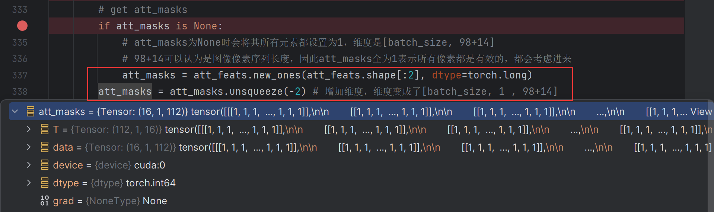

   3. 针对文本序列的掩码张量：之前在对报告文本进行编码时就构建过一次掩码张量(见[3.1.7.1.3.5报告文本的编码](#3.1.7.1.3.5报告文本的编码))；

      1. 由于这里在transformer的解码时需要用到，因此再一次进行掩码张量的构建，构建过程有所不同，不同的地方在下图所示的位置(因为这个掩码张量需要用于解码过程，因此还需要遮蔽后续位置)

         

      2. 综合考虑报告文本的有效元素以及解码时需要遮蔽的位置之后，得到最终的`seq_mask`；整个过程的维度变化为：`[batch_size, max_seq_length]`$\rightarrow$`[batch_size, 1, max_seq_length]`$\rightarrow$`[batch_size, max_seq_length, max_seq_length]`。本例的最终维度如下图所示。

         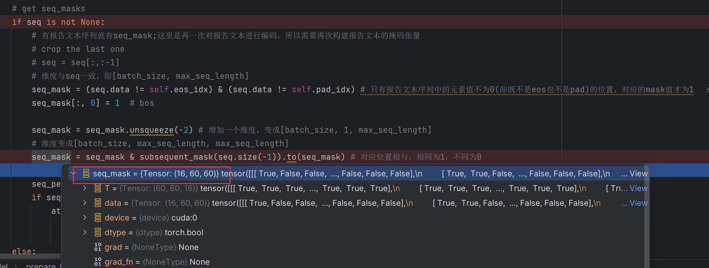

   4. 然后是针对一张图片对应多个文本序列的情况的处理(<font color="blue">这种情况在目前的方法中不存在，但是比如要考虑患者不同时期的报告的时候可能就需要了，或者考虑患者同一时期不同类型的报告的时候</font>)

   5. 最终，返回结果，如下图所示：

      

3. 接下来进入transformer模型，进行编码和解码；输入的参数中，视觉特征`att_feats`对应模型中的`src`，报告文本序列对应模型中的`tgt`，`att_masks`、`seq_mask`分别对应模型中的`src_mask`、`tgt_mask`

   1. 编码时(<a id="anchor2">anchor2</a>)：

      1. 由于图片已经提取了特征了，因此这里的`src_embed`是一个不进行任何操作的匿名函数

         

      2. 为了便于注意力的计算（因为计算评分函数时`scores`的维度将变成`(16,8,112,112)`），`src_mask`增加了一个维度，从`(16,1,112)`变成了`(16,1,1,112)`；另外，`src_mask`全是`1`，表示报告文本序列的所有元素都考虑进来

      3. 计算注意力时，由于是编码，因此`q、k、v`都是视觉特征，维度是`(16,112,512)`；为了进行多头注意力，变换之后的`q、k、v`的维度就变成了`(16,8,112,64)`；计算完多头注意力之后，特征维度就又变回了`(16,112,512)`

   2. 解码时<a name="anchor5">Anchor5</a>：

      1. 首先使用`self.tgt_embed`对目标序列(报告文本序列)进行embedding操作，从而使`tgt`的维度从`(16,60)`变为`(16,60,512)`
      2. 其次进行目标序列的自注意力计算；为了便于注意力的计算（因为计算评分函数时`scores`的维度将变成`(16,8,60,60)`），`tgt_mask`增加了一个维度，从`(16,60,60)`变成了`(16,1,60,60)`；此时的`tgt_mask`是经过`subsequent_mask`的掩码张量，不再是像视觉特征的掩码张量那样，全为`1`了；计算完自注意力之后，目标序列的特征维度变为`(16,60,512)`
      3. 接下来进行编码器堆栈注意力；注意这里使用目标序列(报告文本序列)作为`query`，和之前类似，可以理解为让目标序列关注编码器过来的源序列；掩码张量使用的是源序列，即视觉特征的掩码张量，因为最后使用`p_attn`和`value`相乘，而`value`本质上就是源序列(视觉特征)；
         1. 此处`x`，即报告文本序列的维度是`(16,60,512)`；`m`，即视觉特征经过编码器编码的结果，维度是`(16,112,512)`；掩码张量的维度是`(16,1,112)`，为全`1`的张量
         1. <u>由于视觉特征与文本序列特征不同，构建文本特征的掩码张量的时候是基于subsequent_mask的思想，因此掩码张量最终是一个方阵；而视觉特征的掩码张量不是这个思想，并且本文也是将视觉特征都考虑进来</u>。
   
   3. 最终，得到transformer模型的输出，维度是`(16,60,512)`
   
   4. 最后，对解码器的输出结果进行线性变换，让维度从`[batch_size, max_seq_length, 512]`变成`[batch_size, max_seq_length, vocab_size+1]`，然后进行对数softmax，转化成概率，然后return。
   
      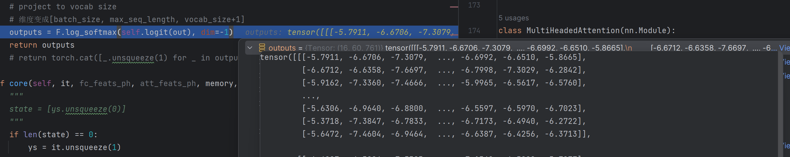
   
      下图是转化成概率之后返回的输出
   
      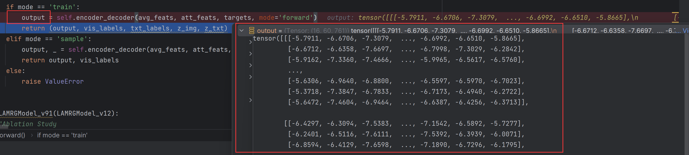


###### 3.1.7.1.3.8返回前向计算结果

1. 返回以下的量：

   1. `output`：是经过对数softmax的解码器的输出结果，维度是`[batch_size, max_seq_length, vocab_size+1]`，这里为`[16,60,761]`
   2. `vis_labels`：两张图片的平均池化特征，经过分类器预测之后的标签结果，维度是`[16,14]`
   3. `txt_labels`：依据报告文本信息预测的疾病标签类别，维度也是`[16,14]`
   4. `z_img`：对综合了(即求平均)两张图片的平均池化特征进行线性变换之后的结果，维度是`[16,512]`
   5. `z_txt`：表示文本特征的汇总，即开始符这个位置的特征，维度是`[batch_size, d_model]`

2. 计算结果返回至`Trainer`类实现的`_train_epoch`方法，如下图所示

   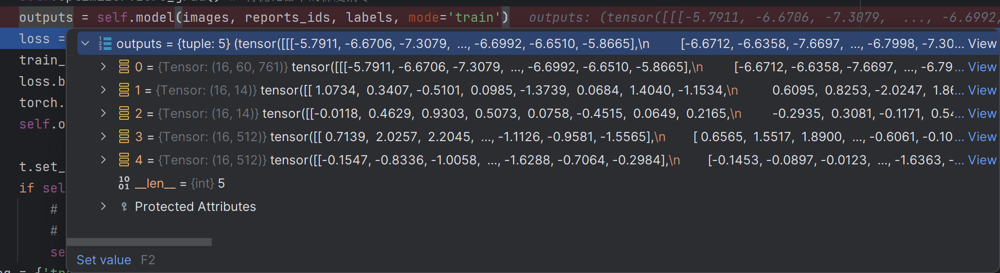

#### 3.1.7.2`train`方法的后续内容

<a name="anchor8">Anchor8</a> 

1. 回到`BaseTrainer`的`train`方法之后，将`epoch`数据也存到日志字典中，然后执行`self._record_best(log)`来更新最佳的结果：

   1. 如下图所示：

      

   2. 更新的过程见<a href="#anchor9">3.1.7.2.1更新最佳结果</a>。

2. 接着执行`self._print_epoch(log)`来打印相关信息，具体见<a href="#anchor10">3.1.7.2.2打印相关信息</a>。

3. 接着，判断一下指标有没有变得更好：

   1. 这里和<u>3.1.7.2.1更新最佳结果</u>没啥区别，唯一的区别是这里只记录了验证集的`BLEU_4`指标值，而`_record_best(log)`记录了验证集和测试集的所有指标值
   2. 如果与最好的相比指标值更好了，那就更新，否则的话，就`not_improved_count += 1`
   3. 因此，`not_improved_count` 记录模型在多少个epoch中性能指标没有得到改善，如果得到改善该变量会重置为`0`，<u>用于判断模型训练什么时候可以停止</u>，如果几个epoch内还没有改进的话，就停止迭代
   4. 如果达到预设的保存检查点的周期，则会保存一次检查点，这里默认每一个epoch都会保存。关于检查点的保存详见<a href="#anchor11">3.1.7.2.3保存检查点</a>。

   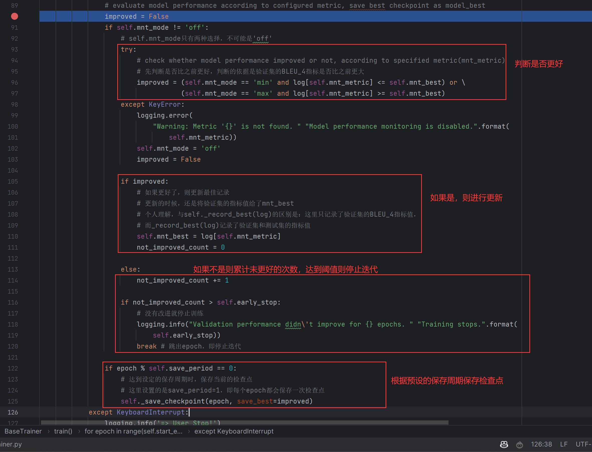

4. 最后，所有epoch结束，打印最好的结果，同时保存最好的结果到文件

   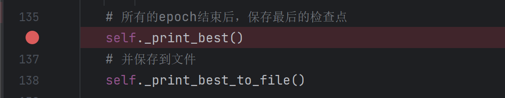


##### 3.1.7.2.1更新最佳结果

<a name="anchor9">Anchor9</a> 

> 1. 初始的最佳记录只有BLEU_4这一个指标，如下图所示：
>
>    
>
> 2. 更新之后，最佳记录中就不止有BLEU_4指标的值了
>
>    
>
> 3. 将更新验证集和测试集的最佳结果

1. 整个过程如下图所示：

   

##### 3.1.7.2.2打印相关信息

<a name="anchor10">Anchor10</a> 

1. 包含的内容有：

   1. 当前的训练轮次(`epoch`)以及检查点目录(`checkpoint_dir`)

      

   2. 将验证集和测试集结果加入到日志中，并在控制台打印出来

   3. 添加验证集和测试集的评价指标及其对应的周期数到tensorboard中

   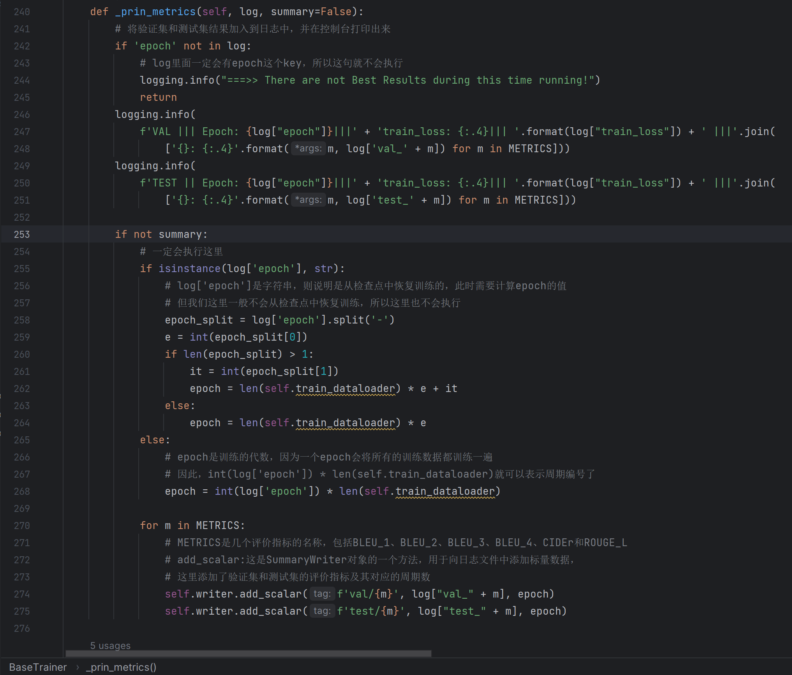

2. 此处打印信息有点问题，不管是在什么情况下调用这个函数，都会将验证集和测试集同时输出，因此在最后执行`self._print_best()`的时候，会出现“验证集中也输出了测试集的结果，测试集中也输出了验证集的结果”，如下图所示：

   

##### 3.1.7.2.3保存检查点

<a name="anchor11">Anchor11</a> 

1. 有两处会进行检查点的保存：

   1. 训练过程中会按照设定的保存周期进行保存操作：达到设定的保存周期时，保存当前epoch的检查点，肯定会保存当前epoch的检查点(要么是interrupt要么是current)；如果这一个epoch的验证集指标更好，则还会保存截至目前的最佳检查点
   2. 当被人为键盘打断时，会保存当时的检查点信息。`_save_checkpoint`函数位于`BaseTrainer`类中

   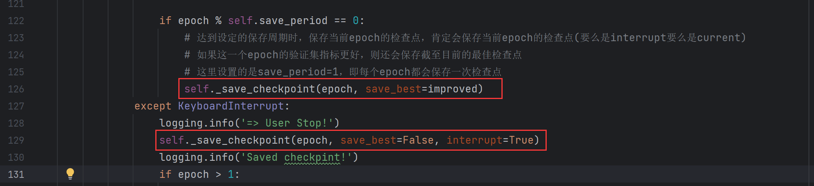

   

## 3.2分析

### 3.2.1关于论文中的标签损失

1. 在代码中，提取图像特征之后，使用平均池化获取经过平均池化的特征，然后将该特征输入到分类器中，从而预测出当前单张图像的疾病标签预测结果，然后将两张图像的疾病标签预测结果取平均值，作为当前患者的最终疾病标签预测结果。

2. 但是，在`forward_iu_xray`执行完毕返回之后，并没有接收返回的`out_labels`，而是在之后又重新预测了标签，这次预测标签的过程和`forward_iu_xray`中预测标签的过程有所不同。但这次预测的标签结果应该是用于后续和真实的标签做对比，计算损失，是视觉-标签对齐的具体实现。

3. 此外，在对报告文本进行编码的时候，还用编码后的结果去预测了疾病标签类别

   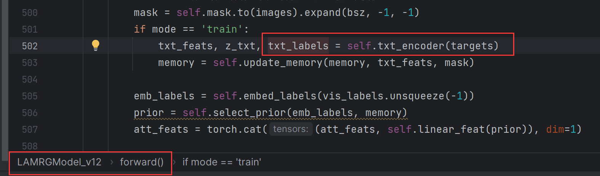

## 3.3报错信息

### 3.3.1找不到指定模块

1. 报错信息如下图：

   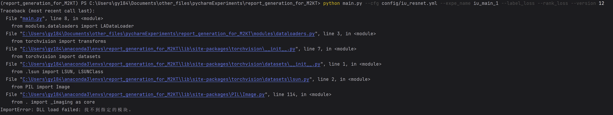

2. 经查，我这里应该是同时装了`PIL`包以及`Pillow`包，[官网](https://pillow.readthedocs.io/en/latest/installation.html)说这两个包不能同时存在于同一个环境中，因此：

   1. 先使用`pip uninstall Pillow`将本环境中存在的`Pillow`删干净（貌似通过这个命令顺带把`PIL`也给删掉了）
   2. 然后使用`pip install Pillow`安装版本合适的`Pillow`
   3. 注意：如果上述方法还是没有解决问题，请看一下是否是`PIL`和`Pillow`包并存了
   
3. 如果间断的出现找不到这里的报错的话，用[这篇文章](https://blog.csdn.net/weixin_42433809/article/details/128994008?spm=1001.2014.3001.5501)说的方法彻底删除`pillow`然后再安装。(目前总是断断续续的报这个错误，还没找到更好的解决办法)

### 3.3.2编码错误

1. 在Windows机器上运行会报这个错误：

   

2. 经查，有一个解决方案可以动态的判断所打开的文件的编码方式（[详见这篇文章](https://blog.csdn.net/mighty13/article/details/107132272)），按照里面的方法做了之后，又报下图的错误：

   1. 通过debug，发现使用[详见这篇文章](https://blog.csdn.net/mighty13/article/details/107132272)将待打开的yaml文件的格式判断成了`ASCII`格式，可能判断错了。
   2. 通过翻看评论区，说打开文件的时候设置成`utf-8`就不报错了，尝试之后，确实不报错了。如下面第二张图所示。

   

   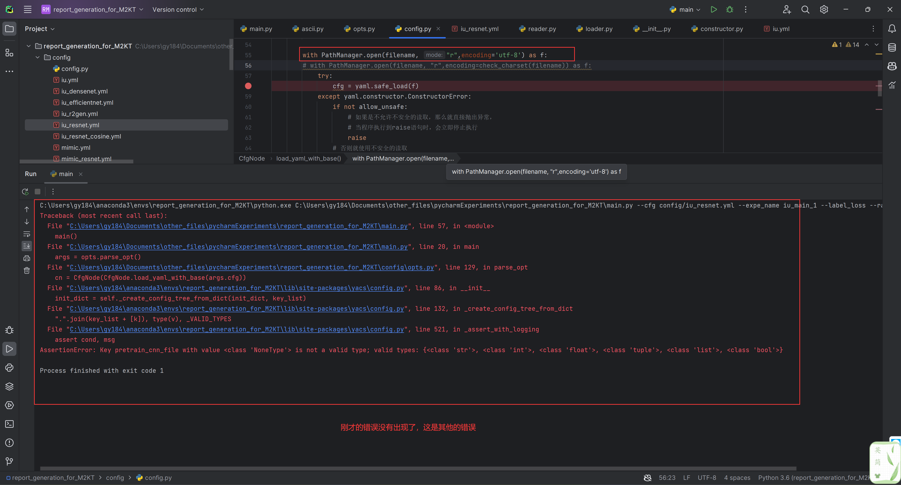

### 3.3.3其他报错信息

1. 找不到`pandas`，直接安装，如下图

   

2. 找不到`pycocoevalcap`包，如下图所示

   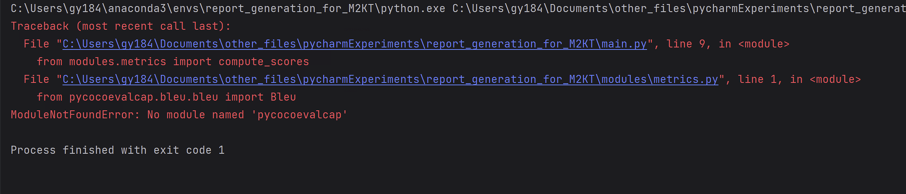

   1. 使用`pip install pycocoevalcap`进行安装，但是安装过程报错，需要安装Microsoft Visual C++ 14.0，如下图所示

      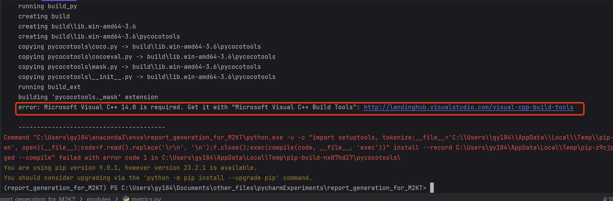

   2. 按照[这篇文章](https://blog.csdn.net/colleges/article/details/123769410)所描述的，安装Visual C++ build tools

   3. 但是还是有问题，按照[这篇文章](https://blog.csdn.net/weixin_40922744/article/details/103687153)所述，还需要安装`Cython`，安装完`Cython`之后，再执行`pip install pycocoevalcap`，就不报错了

3. 通过点击包的名称让pycharm帮我安装`scipy`、`tqdm`、`tensorboardX`，`ipdb`如下图所示

   1. `ipdb`是一个调试器，关于`ipdb`，详细介绍见这里：https://zhuanlan.zhihu.com/p/365255205。使用`pip install ipdb`安装

   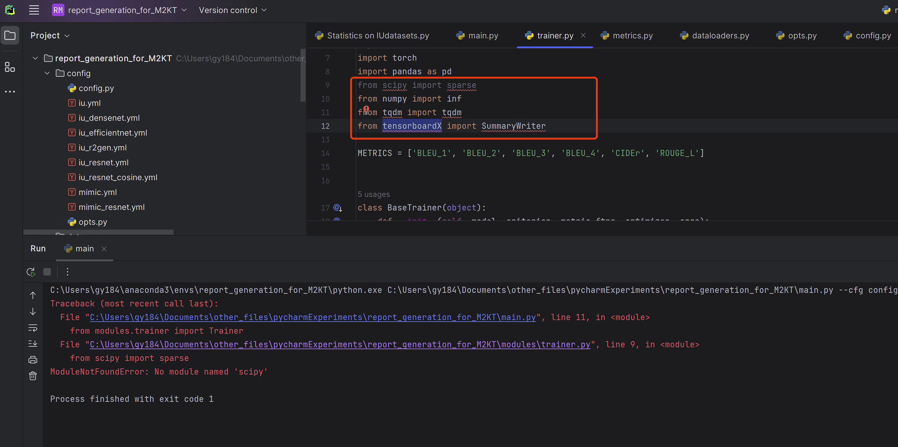

   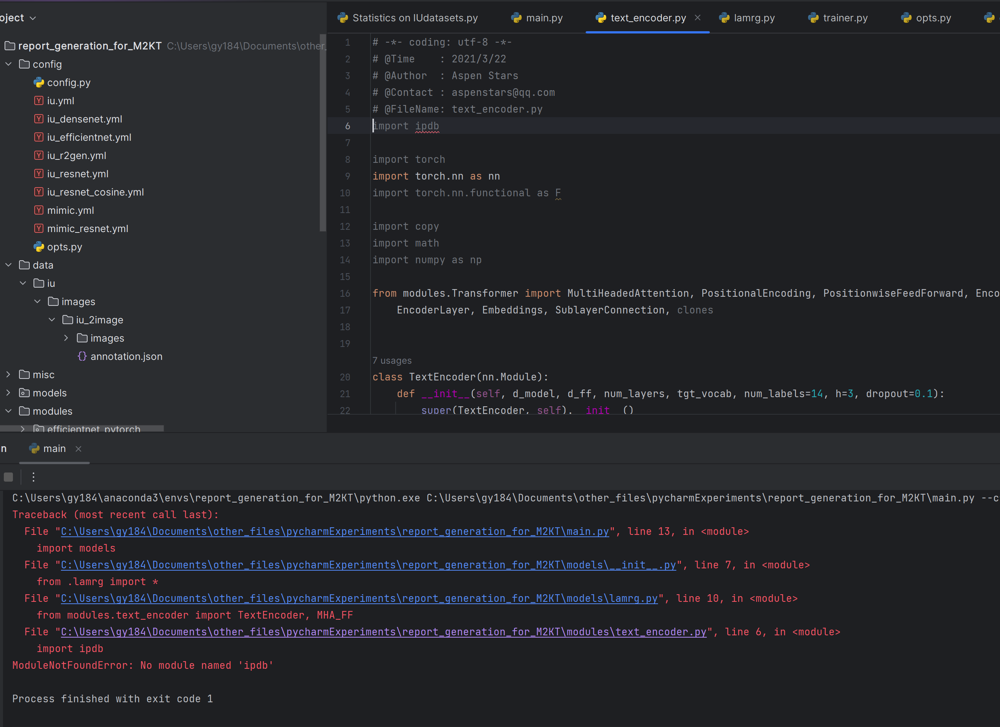

4. 由于`yacs`的版本问题，导致下图所示的报错：

   1. 原先安装的`yacs`版本为`0.1.6`，报了下图的错误
   2. [查阅资料](https://blog.csdn.net/bb_sy_w/article/details/122213038)，说是版本问题，因此先使用`pip uninstall yacs`卸载掉该版本，然后`pip install yacs`默认安装`0.1.8`版本的`yacs`。问题消失。

   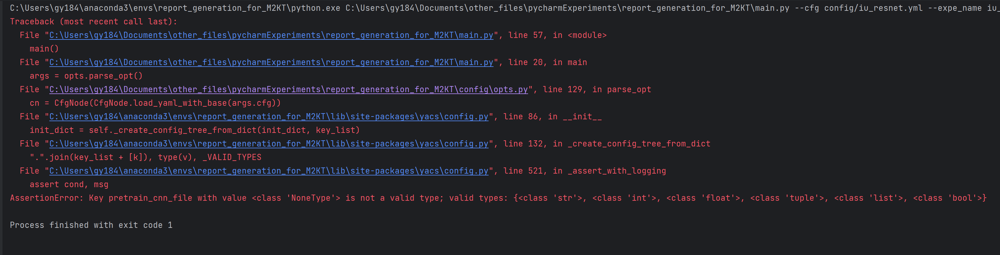


## 4补充

## 4.1损失计算过程

> 使用`compute_loss`函数进行损失的计算

1. `compute_loss`的输入参数如下图所示

   

   对应的调用`compute_loss`时传入的参数如下图所示(传入的`txt_label`并没有使用)：

   

2. 然后创建一个损失的对象，是`LanguageModelCriterion`类的实例，该类继承自`nn.Module`，初始化的时候没有额外的操作，如下图所示：

   

### 4.1.1损失计算

#### 4.1.1.1计算交叉熵损失

> 1. 执行`loss = criterion(output[:, :-1], reports_ids[:, 1:], reports_masks[:, 1:]).mean()`语句，调用`LanguageModelCriterion`类的`forward`方法
> 1. `forward`方法中计算的损失对应于论文中的Textual–Textual Alignment，即真实报告和生成的报告之间的对齐，也即交叉熵损失

1. 用到的参数或者说张量：

   1. `input`形参：实际传入的是`output[:, :-1]`，维度是`(16,59,761)`，`output`维度是`(16,60,761)`，去掉的是结束符所在的位置(和transformer里面的损失计算是对应上的)
      1. <font color="red">模型的预测输出序列`output`的第二个维度，即长度为`60`的维度，该维度上第一个元素是对真实报告文本中第一个词的预测(结合transformer中下一个词预测这种思想)，而该维度上最后一个元素应该是对报告文本的结束符的预测；因此计算交叉熵损失的时候传入的是`output[:, :-1]`而不是`output`</font>
   2. `target`形参：实际传入的是`reports_ids[:, 1:]`，维度是`(16,59)`，`reports_ids`的维度是`(16,60)`，去掉了第一个元素，即开始符(和transformer里面的损失计算是对应上的)，不过还是保留了填充符和结束符
      1. <font color="red">`reports_ids`中的第一个元素是开始符，需要将其去掉，这样第一个元素才是真实文本序列的第一个词</font>；
   3. `mask`形参：与`target`对应，所以实际传入的是`reports_masks[:, 1:]`，维度是`(16,59)`，`reports_masks`的维度是`(16,60)`

2. 进入`forward`函数之后，根据`input`对`target`和`mask`进行截断(如下图所示)，目的是保证这三个量在序列长度(即文本长度)上是一样的，但是在传进来的时候就已经做了处理了，已经是长度一样，都是`59`，所以这里的操作前后没有变化

   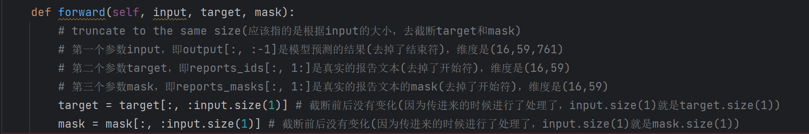

3. 接下来为计算交叉熵损失(<font color="red">后面详细看一下交叉熵损失的原理</font>)做准备：交叉熵损失就是模型输出转化成概率之后的和的平均，如下图所示是论文中交叉熵的计算公式：

   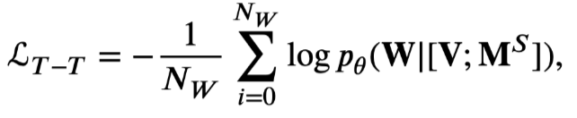

   1. 该公式理解为：在知道视觉特征以及记忆矩阵之后模型预测的输出结果，转化成概率(在代码中的实现就是进行了对数softmax)之后，把每个位置的预测概率求和然后求平均，因为已经是对数softmax了，所以就不用再求对数了

   2. 对应的处理代码为：`output = -input.gather(2, target.long().unsqueeze(2)).squeeze(2) * mask`

      1. `target.long().unsqueeze(2)`：将`target`变成长整型(`int64`)，便于计算，然后扩展维度，使得`target`的维度从`[16,59]`变成`[16,59,1]`
      2. `input.gather(2, target.long().unsqueeze(2))`：
         1. `gather(dim,indexs)`函数：在`dim`维度(`dim`从`0`开始)上，按照`indexs`所给的坐标选择元素，返回一个和`indexs`维度相同大小的tensor
         2. 因此这里是在最后一个维度(`dim=2`)上按照`target`最后一个维度给出的索引(即词表的索引)从`input`中拿到对应位置的元素，本质上就是从模型输出的概率序列中获取真实token的预测概率值
         3. 返回的Tensor的维度是`[16,59,1]`
      3. 然后使用`squeeze(2)`把最后一个维度删掉，变回`[16,59]`，其中的每个元素就代表模型对真实token的预测概率
      4. 然后乘上`mask`，将填充符对应的概率置为`0`，这样在计算损失的时候就不会把填充的位置考虑进来了

      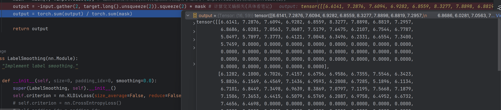

   3. 对应的最终交叉熵损失计算代码为`output = torch.sum(output) / torch.sum(mask)`：

      1. `torch.sum(output)`：是对这一批数据的所有预测概率值进行求和
      2. `torch.sum(mask)`：用于求总共有多少个token；用`mask`来计算的原因是`mask`中的填充符和结束符(开始符是`1`)都是`0`，求和之后正好就没有把填充符和结束符的位置算进去

      

4. 如下图所示，是<u>交叉熵损失的计算结果</u>：

   

5. 语句`loss = criterion(output[:, :-1], reports_ids[:, 1:], reports_masks[:, 1:]).mean()`中的mean()函数没有改变损失的数值，因为在计算交叉熵损失函数的时候就已经平均过了：

   1. 如下图所示，在`mean()`作用了之后，损失值没有发生变化，但是反向传播函数发生了变化，从`DivBackward0`变成了`MeanBackward0`如下图所示：

      <font color="red">关于不同的梯度函数的区别，比如这里数值上没有变化，但是梯度函数变了，变化前后有影响吗？</font>

      

      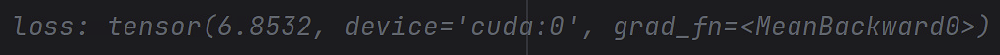

#### 4.1.1.2计算标签损失

> 1. 对应论文中的Visual–Label Alignment

1. 使用的是二分类交叉熵损失(<font color="red">后续可以详细看一下</font>)，即结合了二进制交叉熵损失(Binary Cross Entropy Loss)和逻辑斯蒂激活函数(Logit function)，公式如下：

   

2. 首先创建二分类交叉熵损失对象；对应的函数是pytorch自带的，即`torch.nn.BCEWithLogitsLoss()`

3. 然后传入预测的标签和真实的标签，得到损失结果

   1. 真实的标签和预测的标签的维度都是`[16,14]`，但是预测的标签变量中的元素是概率值，而真实的标签变量的元素不是概率值

      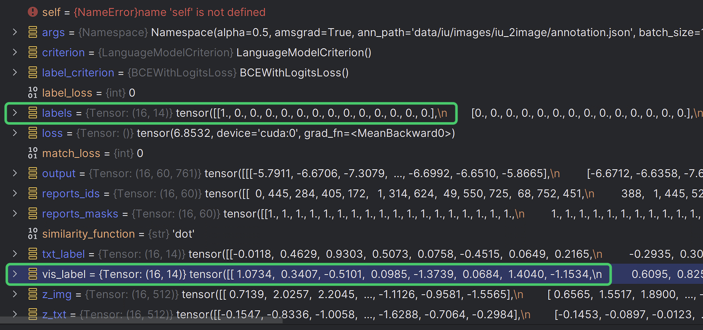

   2. 损失值如下图所示：

      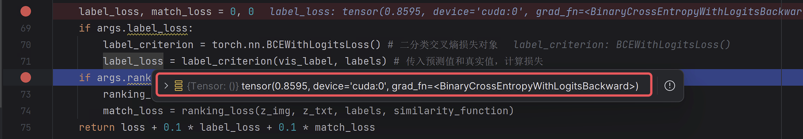

#### 4.1.1.3视觉文本对齐

> 1. 是论文中的Visual–Textual Alignment
> 2. 代码中对应的损失对象为自定义的`RankingLoss`类

1. 首先创建`RankingLoss`对象；初始化的时候没有什么需要特别指出的操作；

2. 调用`ranking_loss`的`forward`方法进行损失的计算，传入如下参数：

   ```
       # z_image: (batch_size, 512):综合了(即求平均)两张图片的平均池化特征进行线性变换之后的结果
       # z_text: (batch_size, 512):文本特征的汇总，即开始符这个位置的特征
       # labels: (batch_size, 14):真实的标签
       # similarity_function: 'dot' or 'cosine' or 'l2'
   ```

   1. 基于triplet margin loss（<font color="blue">后续详细看一下</font>）计算损失，需要分别给图像和文本计算损失，分别调用`imposter_img_loss`和`imposter_txt_loss`
   2. 两个函数传入的参数都是一样的：
      1. `self.imposter_img_loss(z_image, z_text, labels, similarity_function)`
      2. `self.imposter_txt_loss(z_image, z_text, labels, similarity_function)`

##### 4.1.1.3.1imposter_img_loss函数

1. 整个流程：获取批次大小$\rightarrow$遍历这批数据的每一个样本$\rightarrow$针对每个样本，选择一个这个批次中的其他样本的图像作为冒名图像$\rightarrow$然后基于配对图像和冒名图像所对应的疾病标签的差异计算`margin`，作为距离的基本量$\rightarrow$然后计算相似度$\rightarrow$然后构建差异相似度加入到损失值中

2. 对于冒名图像的选择：这是单纯通过`j = i + 1 if i < batch_size - 1 else 0`选择固定的冒名图像，<font color="blue">是可以改进的一个点</font>。

3. 对于`margin`的计算：若两张图像的标签完全一样，则`margin=0`，否则依据论文中的公式计算`margin`

   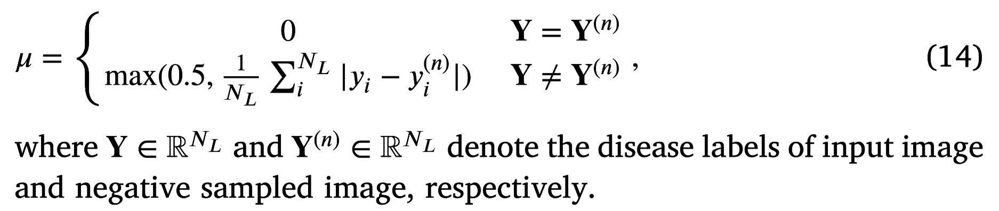

   ```python
   if torch.equal(labels[i], labels[j]):
       # This means the imposter image comes from the same acquisition
       # 这里的margin就是所谓的image label difference,对应论文公式(14)中的μ
       # 如果两个图像的标签相同，则边界为0
       margin = 0
   else:
       # labels[i].int() | labels[j].int()：按位或，即两个标签中有一个为1，结果就为1
       # 然后求和，并使用item()方法将结果转换为Python标量，即获取了求和的结果
       n = (labels[i].int() | labels[j].int()).sum().item() # 或运算，再求和;用于对diff进行平均;与论文中的N_L稍有不同
       # labels[i].int() ^ labels[j].int()：按位异或，相同为0，不同为1
       diff = (labels[i].int() ^ labels[j].int()).sum().item() # 异或运算，再求和,对应论文公式(14)中的对应元素相减求绝对值再求和
       margin = max(0.5, diff / n)
   ```

4. 对于相似度的计算：分别计算配对图像-文本对和冒名图像-文本对的相似度，即`paired_similarity`和`imposter_similarity`，根据`similarity_function`的不同，选择不同的函数进行计算，这里默认使用点积的方式

   1. 看了代码之后，发现论文中的公式描述有问题，因为实际实现的时候，不管是`paired_similarity`还是`imposter_similarity`，都是配对的图像和冒名的图像分别与配对的文本进行相似度的计算，<u>不是下图公式中框选出来的那部分</u>

      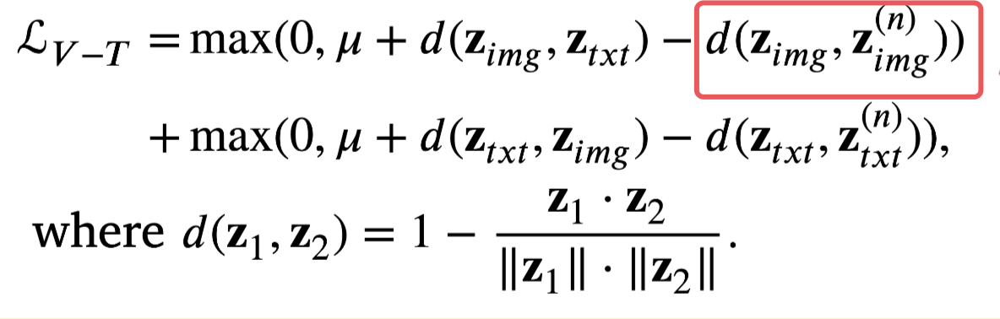

5. 将相似度计算结果加入到损失中：

   1. 最终的损失是越小越好，因此加上`imposter_similarity`，减去`paired_similarity`，这样就是最大化`paired_similarity`了；
   2. 这里直接用相似度值构建损失，与论文公式(12)不同，公式(12)是用`1-相似度`作为距离构建损失的，但是效果应该是一样的

   ```python
   diff_similarity = imposter_similarity - paired_similarity + margin
   if diff_similarity > 0:
       loss = loss + diff_similarity
   ```

##### 4.1.1.3.2imposter_txt_loss函数

1. 大部分内容与`imposter_img_loss`一样，唯一的区别在于这里是选择冒名的文本：即计算相似度的时候，使用冒名的文本与配对中的图像计算`imposter_similarity`

   

   

##### 4.1.1.3.3将两个损失加起来

1. 将这两个损失加起来作为视觉-文本对齐的损失，即像文中所说的，双向的对齐

   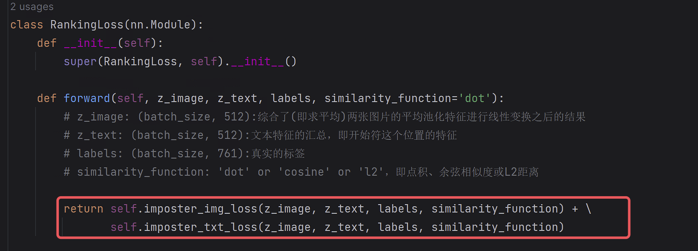

#### 4.1.1.4整合损失

1. 代码中，基本的损失(即Textual–Textual Alignment，交叉熵损失)前面的权重是`1`，Visual–Label Alignment和Visual–Textual Alignment前面的权重是固定的`0.1`(<font color="blue">其实这两个前面的权重也可以改进，即变成动态的</font>)

   

2. 公式中是这样的，但其实没有去动态平衡

   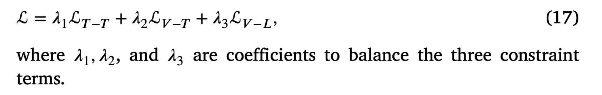

### 4.1.2损失计算结果


## 4.2当前epoch下对模型进行验证

1. 首先将模型设置为评估模式，并根据传入的`mode`参数选择验证集或者测试集作为数据来源；然后使用`torch.no_grad()`方法让模型不去计算梯度，只进行计算；如下图所示：

   

2. 接下来，和训练时的计算步骤类似，先设置进度条$\rightarrow$然后使用循环一批一批读取数据$\rightarrow$将读取进来的数据传递到GPU上

3. 然后执行`outputs = self.model(images, mode='sample')`进行模型的计算，这里与训练数据不同的是，只传入了`images`，并且`mode=“sample”`；

4. 但是和训练的时候也有相同的计算内容：

   1. 提取图像特征、视觉标签、获取`memory`
   2. 然后让视觉标签去注意一下`memory`
   3. 然后将提取的图像特征与注意过`memory`的视觉标签连接起来，作为最终的图像特征

   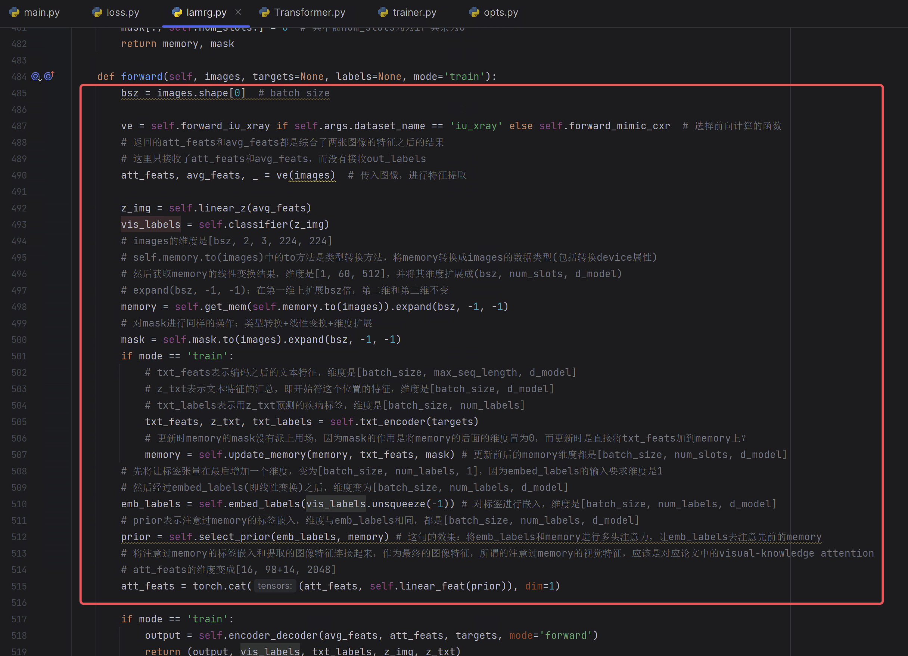

5. 和训练的时候不同的地方如下图所示(<a href="#anchor7">具体过程见4.2.1使用encoder_decoder计算输出</a>)：

   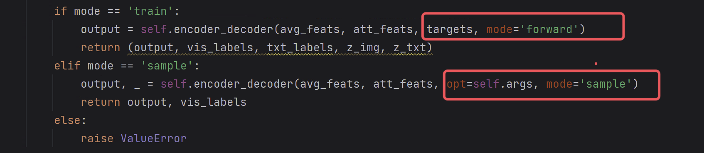

6. 执行完上图中的`encoder_decoder`之后，并将结果返回至`Trainer`类的`_test_step`方法中，如下图中的`outputs`，其中就包含返回过来的`output`和`vis_labels`。

   

7. 然后对预测的结果进行解码：

   1. 下图是解码调用逻辑

   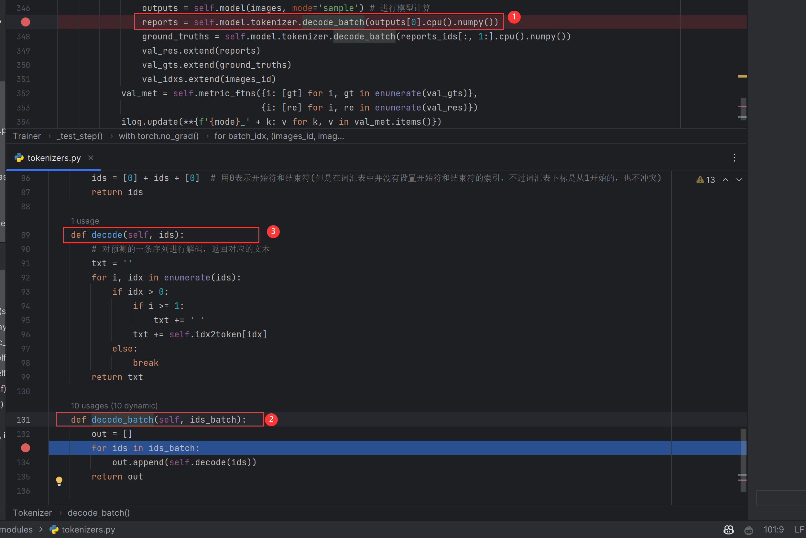

   2. 下图是解码输出结果：

   

8. 然后使用评价方法进行评估：

   1. 通过如下语句调用评估方法：

      ```python
      val_met = self.metric_ftns({i: [gt] for i, gt in enumerate(val_gts)},
                                 {i: [re] for i, re in enumerate(val_res)})
      ```

   2. 将会调用`compute_scores`方法进行评估，最终得到`eval_res`字典，其中存放着每个评估指标的得分(<font color="red">需要详细了解一下BLEU指标</font>)

      

      

9. 然后执行如下语句将指标的计算结果都存放到`ilog`字典中，

   1. ```python
      ilog.update(**{f'{mode}_' + k: v for k, v in val_met.items()})
      ```

      

10. 然后执行`self._output_generation(val_res, val_gts, val_idxs, epoch, iters, mode)`：

    1. 将模型预测结果、真实结果、迭代信息和数据集划分信息保存到一个json文件中，然后返回到`_train_epoch`

       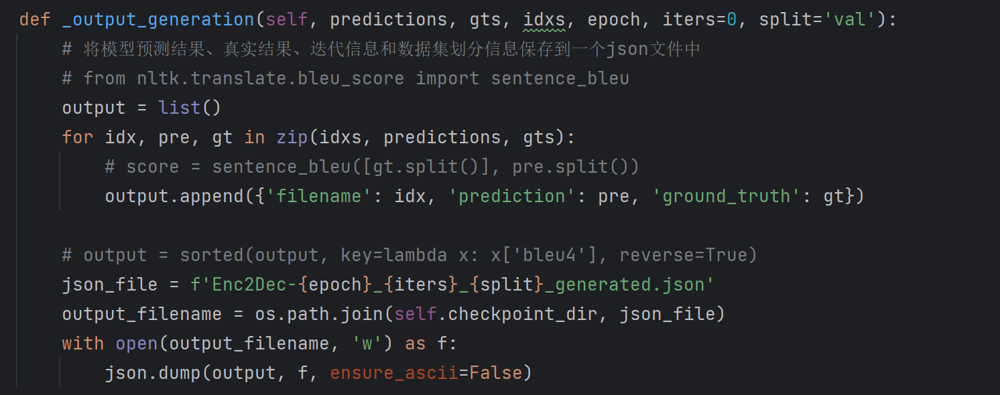

(<a name="anchor7">Anchor7</a> )

### 4.2.1使用encoder_decoder计算输出

1. 和训练集一样，也是先调用`CaptionModel`的`forward`方法(如下图所示)；这里传入了两个关键字参数`opt=self.args`和`mode='sample'`，因此接下来将调用`AttModel`类的`_sample`方法：

   

2. `_sample`方法的参数如下：

   1. `fc_feats`：对应于`avg_feats`，综合了两张图片特征之后的平均池化特征(即对两张图片的平均池化特征求平均)，维度是`(16,2048)`
   2. `att_feats`：对应于`att_feats`，提取出来的图像特征(综合了两张图片的特征，且注意过`memory`)，维度是`(16,112,2048)`
   3. `opt`：是一开始运行模型的时候使用到的相关参数

#### 4.2.1.1_sample方法的具体过程

> 1. 首先：获取一些参数
> 2. 其次：执行`AttModel`类的`self._sample_beam(fc_feats, att_feats, att_masks, opt)`方法，执行完之后直接在此返回

1. 首先获取一些参数，这些参数的含义及默认值如下图所示：

   ```python
   sample_method = getattr(opt, 'sample_method', 'greedy')
   beam_size = getattr(opt, 'beam_size', 1)
   temperature = getattr(opt, 'temperature', 1.0)
   sample_n = int(getattr(opt, 'sample_n', 1))
   group_size = getattr(opt, 'group_size', 1)
   output_logsoftmax = getattr(opt, 'output_logsoftmax', 1)
   decoding_constraint = getattr(opt, 'decoding_constraint', 0)
   block_trigrams = getattr(opt, 'block_trigrams', 0)
   remove_bad_endings = getattr(opt, 'remove_bad_endings', 0) # 参数中没有此项设置，因此默认是0
   ```

   

   

2. 剩下有很多代码，但是由于`if beam_size > 1 and sample_method in ['greedy', 'beam_search']:`一定会成立，所以会去执行`AttModel`类的`self._sample_beam(fc_feats, att_feats, att_masks, opt)`方法，执行完之后直接在此返回。

   

##### 4.2.1.1.1执行AttModel类的_sample_beam方法

> 1. 首先也是获取一些参数
> 2. 其次，调用`TransformerModel`类的`_prepare_feature`方法对`fc_feats`和`att_feats`进行一些处理(<a href="#anchor3">看这里</a>)，包含：
>    1. 调用`TransformerModel`类的`_prepare_feature_forward`方法对视觉特征进行embedding操作(本质上是一个线性层+dropout层)，以及生成了一个视觉特征的掩码张量
>    2. 调用transformer模型的`EncoderDecoder`类，但只进行编码得到编码器堆栈的输出(<a href="#anchor4">看这里</a>)
> 3. 接着，初始化`seq`及其概率（项目符号列表3），初始化仅含开始符的目标序列（项目符号列表4）
> 4. 然后基于视觉特征以及初始化的目标序列去预测下一个词（项目符号列表4）
> 5. 然后基于束搜索给每一张图片生成3个候选解（项目符号列表5、6）
> 6. 然后基于束搜索结果返回最可靠的序列以及概率（项目符号列表7、8）

1. 首先也是获取了一些参数的值，如下图所示：

   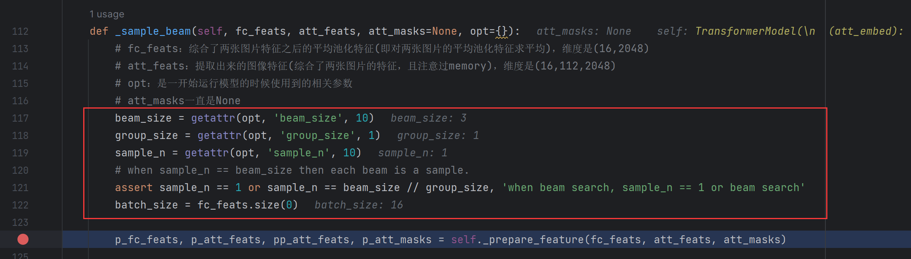

2. 然后进入到`TransformerModel`类的`_prepare_feature`方法对`fc_feats`和`att_feats`进行一些处理

   1. 本质上还是调用了`TransformerModel`类的`_prepare_feature_forward`方法，如下图所示(<a id="anchor3">anchor3</a>)：

      

   2. 传入的变量只有`att_feats`和`att_masks`，而训练时还传入了`seq`，如下图所示；不过与训练时一样的是：`att_masks=None`

      1. 因为训练时，模型计算同时需要源序列和目标序列，而验证的时候只需要源序列，然后得出`output`，再去与真实的目标序列进行对比

      

   3. `_prepare_feature_forward`方法的整个过程可以<a href="#anchor1">看这里</a>。这里只说明不同的地方：

      1.  由于这里是验证，因此没有传入报告文本序列，即目标序列，所以`seq=None`，所以就不需要为报告文本生成掩码序列，即`seq_mask = None`，如下图所示：

         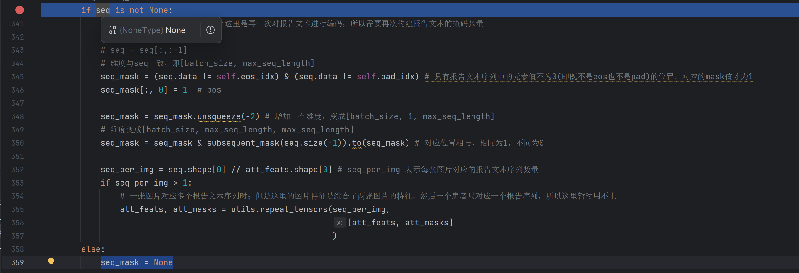

      2. 所以，验证的阶段，`_prepare_feature_forward`方法只是对视觉特征进行embedding操作(本质上是一个线性层+dropout层)，以及生成了一个视觉特征的掩码张量

      3. 最后返回了`att_feats`, `seq`, `att_masks`, `seq_mask`，其中`seq`和`seq_mask`都是`None`，如下图所示：

         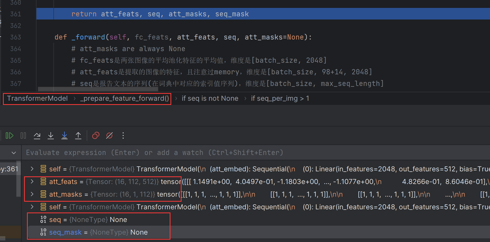

   4. 在`TransformerModel`类的`_prepare_feature`方法中，调用完`_prepare_feature_forward`方法之后，将调用transformer模型的`EncoderDecoder`类，与训练阶段不同的是，在验证阶段，只是调用其中的编码器对注意过`memory`的视觉特征进行编码，如下图所示(<a id="anchor4">anchor4</a>)：

      

      1. 编码的过程可以<a href="#anchor2">看这里</a>；编码结束得到的就是编码器堆栈的输出，这里记为了`memory`，维度是`[16,112,512]`，如下图所示：

         

      2. 最后返回结果：

         1. `fc_feats[..., :0]`：`fc_feats`在`_prepare_feature`方法中没有进行任何处理

            ```python
            # fc_feats[..., :0]表示对数组fc_feats进行切片操作，其中...表示省略其他维度，:表示选择该维度的所有元素，而:0表示选择该维度的前0个元素
            fc_feats[..., :0]
            Out[2]: tensor([], device='cuda:0', size=(16, 0)) # 注意size没变，但是是空的
            ```

         2. `att_feats[..., :0]`：经过embedding操作(本质上是一个线性层+dropout层)，因此经过`_prepare_feature`方法之后，`att_feats`维度从`[batch_size, 98+14, 2048]`$\rightarrow$`[batch_size, 98+14, 512]`$\rightarrow$并以`[16, 112, 0]`返回

            ```python
            att_feats[..., :0]
            Out[3]: tensor([], device='cuda:0', size=(16, 112, 0)) # 注意size没变，但是是空的
            ```

         3. `memory`：注意过`memory`的视觉特征经过编码器堆栈的计算结果，维度是`[16,112,512]`

         4. `att_masks`：视觉特征的掩码张量，全为`1`；维度是`[16,1,112]`

         

3. 接下来创建`seq`和`seqLogprobs`变量，应该是用于存放模型在给定视觉特征的情况下生成的报告文本

   1. `seq`：由`seq = fc_feats.new_full((batch_size * sample_n, self.seq_length), self.pad_idx, dtype=torch.long)`语句创建，关于此语句的解释如下图所示：

      1. 由此可见，`sample_n`的描述“the sample number per image”可以理解为：为每一张图像生成的文本描述的数量

      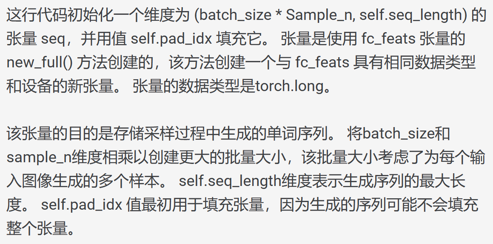

   2. `seqLogprobs`：由`seqLogprobs = fc_feats.new_zeros(batch_size * sample_n, self.seq_length, self.vocab_size + 1)`语句创建，关于此语句的解释如下图所示：

      

   3. 下图是`seq`和`seqLogprobs`的创建的结果，`seq`的维度是`[16,60]`，元素全是填充符；`seqLogprobs`的维度是`[16,60,761]`，元素都是`0`，如下图所示；

      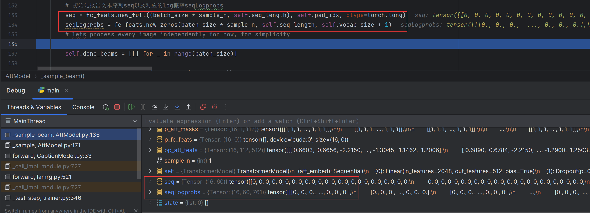

4. 然后初始化了一个序列，名为`it`，其中的元素都是开始符(即`0`)，维度是`(16,)`；然后调用`AttModel`类的`get_logprobs_state`方法(<a <a href="#anchor6">>见4.2.1.1.1.1调用`get_logprobs_state`方法</a>)，

   1. 作用是：在已有视觉特征、视觉特征掩码的情况下，对初始化了的仅有开始符的目标序列进行预测，预测下一个词，最后返回模型的概率输出&初始化的仅有开始符的目标序列

5. 然后根据`beam_size`的大小将`p_fc_feats`、`p_att_feats`、`pp_att_feats`、`p_att_masks`重复`beam_size`次

   1. ```python
      p_fc_feats：维度变成是(48,0)；p_att_feats：维度变成是(48, 112, 0)；pp_att_feats：即编码器堆栈的输出memory，维度变成是(48,112,512)；
      p_att_masks：维度变成[48,1,112]，是p_att_feats的掩码张量
      ```

   2. 目的是进行束搜索，下图是一个简单的解释：

      

6. 接下来就进行束搜索(beam_search)(<font color="blue">关于具体的束搜索过程，后面看一下</font>)，得到下图所示的结果

   1. 是一个长度为`16`的列表，每个列表又包含`3`个元素，对应于`beam_size=3`；每个元素又是一个字典，包含了序列预测结果、概率值等；
   2. 一个批次有`16`张图像(综合之后一个批次相当于1张图像)，即利用束搜索给每张图像生成`3`个报告文本序列
   3. 需要注意的是，每个预测出来的文本序列长度不是固定的

   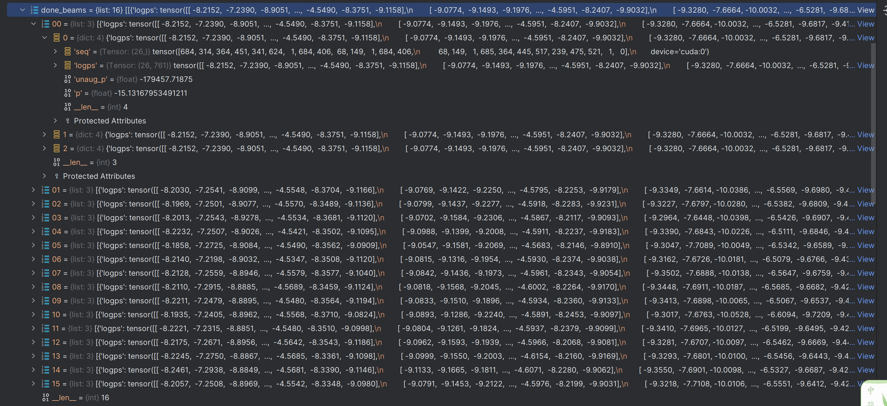

7. 根据束搜索结果，完善之前创建的`seq`以及对应的概率，作为基于视觉特征预测的文本序列以及对应的概率值

   1. 通过循环为这批数据的每个图像赋值文本序列及概率值

   2. 束搜索给每个图像都生成了`3`个候选的文本序列预测结果，而第一个具有最高的得分，因此从第一个候选结果中获取预测值，过程如下图所示：

      

   3. 由于<u>每个预测的文本序列长度不固定</u>，因此原先初始化`seq`及其概率的时候，设置的默认值`0`就起作用了，如下图所示：

      

      

8. 最终的结果如下图所示：

   

   1. 之后逐层返回，最后返回到`LAMRGModel_v12`类的`forward`方法中，如下图所示

      1. 返回之后就是下图中的`output`，维度是`[16,60]`；<u>返回过来的概率之后就没有利用了</u>。

      

   2. 调用`AttModel`类的`_sample`方法返回结果到`LAMRGModel_v12`类的`forward`方法之后，将基于视觉特征，用束搜索算法生成的文本序列以及视觉标签返回，如下图所示

      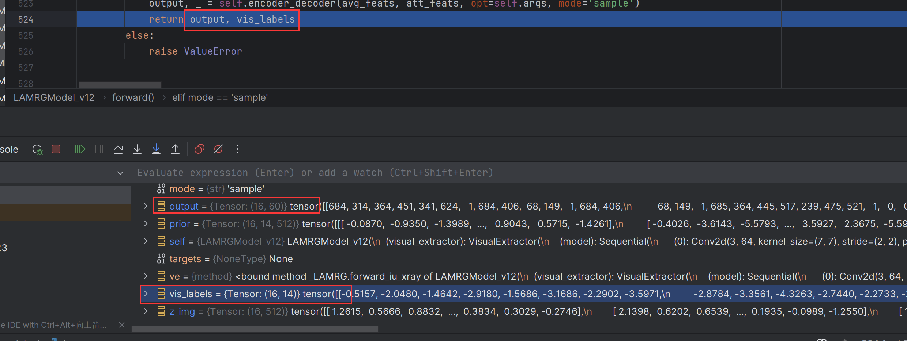

###### 4.2.1.1.1.1调用`get_logprobs_state`方法

1. 传入的参数如下图所示(<a name="anchor6"></a>)：

   

2. 然后调用`TransformerModel`类的`core`方法：

   1. 由`it`构建`ys`，其实就是将维度变成`[16,1]`，元素依旧都是开始符`0`

   2. 然后将注意过`memory`的视觉特征经过编码器堆栈的计算结果，即编码器堆栈的输出`memory`及其掩码张量、刚刚构建的`ys`(这里应该是作为目标序列)及其掩码张量传入到encoder_decoder的解码器部分进行解码过程(<a href="#anchor5">解码的详细过程</a>)，不同的地方在于：这里`tgt`的维度是`[16,1]`，进而导致`tgt_mask`等后续张量维度与之前稍许不同。以下是解码的结果：

      1. 使用`self.tgt_embed`对目标序列(报告文本序列)进行embedding操作，从而使`tgt`的维度从`(16,1)`变为`(16,1,512)`
      2. 目标序列的自注意力计算结果的维度是`[16,1,512]`
      3. 然后进行编码器堆栈的注意力计算：让目标序列去注意一下视觉特征，得到的结果的维度依旧是`[16,1,512]`
      4. 之后是前馈神经网络层
      5. 最终解码的结果如下图所示，`out`的维度是`[16,1,512]`

      

   3. 然后返回结果：

      1. `out[:, -1]`：相当于根据视觉特征去预测报告文本序列开始符的下一个词是什么；将`out`的维度从`[16,1,512]`变成`[16, 512]`，然后返回，就是降了维度，如下图所示；

         

      2. `[ys.unsqueeze(0)]`：目标序列，仅包含开始符；给`ys`增加了一个维度，维度从`[16,1]`变成`[1, 16, 1]`，然后装在一个列表中返回，如下图所示：

         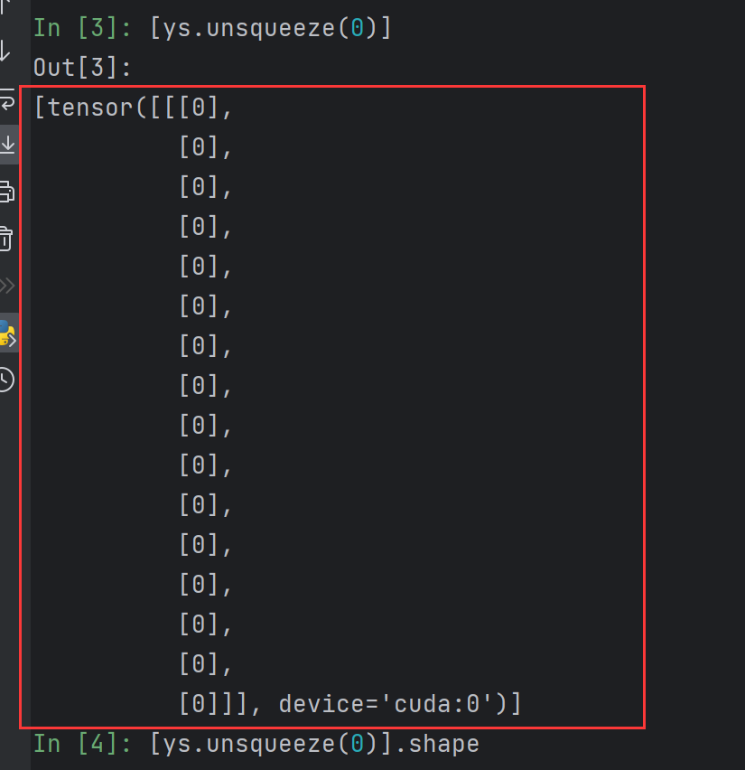
         
      3. 返回之后，`out[:, -1]`和`[ys.unsqueeze(0)]`分别对应`output, state = self.core(xt, fc_feats, att_feats, p_att_feats, state, att_masks)`语句中的`output`和`state`。

3. 然后对输出进行softmax：

   1. 首先对`output`进行线性变换，维度从`[16, 512]`变成`[16, 761]`；然后使用`log_softmax`转换成概率`logprobs`，如下图所示：

      

4. 然后返回概率`logprobs`以及状态`state`；

   1. 所谓的状态就是当前的目标序列；在此处此时的目标序列就是全部都是开始符

## 1.3当前epoch下对模型进行测试

1. 测试的过程与验证类似
